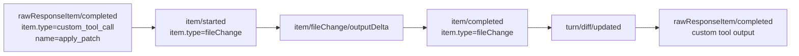

# Codex Raw Event Mapping

## Purpose

This document is the canonical audit table for how raw Codex App Server thread events are interpreted inside `autobyteus-server-ts`, applied to Codex thread state, and converted into normalized `AgentRunEvent`s.

Use this document when:
- debugging a runtime behavior mismatch,
- reviewing Codex event-conversion changes,
- deciding whether a raw event should drive lifecycle, artifact, activity, or thread-state readiness,
- checking whether an older raw-event name is still part of the active protocol.

## Authoritative Boundary

The authoritative raw-event interpretation boundaries live under:

- `src/agent-execution/backends/codex/thread/`
- `src/agent-execution/backends/codex/events/`
- `src/agent-execution/backends/codex/history/` for diagnostic `thread/read` replay
- `src/agent-execution/backends/codex/items/` for shared tool item payload parsing

The most important owners are:

- `codex-thread-notification-handler.ts` — authoritative owner for applying raw notification side effects to `CodexThread` state (`threadId`, status, active turn, token-usage readiness)
- `codex-thread-token-usage.ts` — owner for converting Codex `last` / `total` usage readings into scoped, idempotent token usage payloads for later ledger enrichment
- `codex-thread-event-converter.ts` — top-level Codex raw-message dispatcher
- `codex-item-event-converter.ts` — authoritative owner for `item/*` event fan-out
- `codex-turn-event-converter.ts` — authoritative owner for `turn/*` events
- `codex-thread-lifecycle-event-converter.ts` — authoritative owner for `thread/*` and `error`
- `codex-raw-response-event-converter.ts` — raw-response sidecar normalization
- `codex-thread-server-request-handler.ts` — server-request handling for approval requests and dynamic tool calls
- `codex-thread-history-reader.ts` — owner for diagnostic `thread/read` retrieval and protocol replay inspection
- `codex-thread-history-item-normalizer.ts` — owner for mapping diagnostic `thread/read` item families into historical replay tool facts
- `codex-tool-item-family.ts` and `codex-tool-payload-parser.ts` — shared item family and payload extraction helpers used to keep live conversion and history replay aligned

Higher layers should depend on `CodexThread` state and normalized `AgentRunEvent`s exposed by these owners. They should not infer Codex raw protocol details themselves.

Codex thread status changes update `CodexThread` state first. The normalized
`AGENT_STATUS` event is then projected from that thread-owned snapshot into the
server WebSocket contract `{ status: "offline" | "initializing" | "idle" | "running" | "error",
can_interrupt: boolean }`; raw provider status payloads are not forwarded and
legacy transition-field names are not emitted.
Startup thread statuses project as `initializing` with `can_interrupt: false`;
active generation/tool statuses project as `running`, and only `running`
snapshots can expose interrupt authority.

Codex token usage follows the same thread-state-first pattern. Raw
`thread/tokenUsage/updated` notifications are parsed into `CodexThread` usage
state, preserving whether the provider reported `last` usage or only cumulative
`total` usage. `CodexAgentRunBackend` later emits ready `TOKEN_USAGE_UPDATED`
events from that state; server token-usage enrichment owns canonical identity,
cumulative-snapshot delta normalization, cost status, and persistence. Higher
layers must not parse raw Codex token payloads directly or sum cumulative totals
as deltas.

`codex-thread-token-usage.ts` also owns the runtime-specific field promotion for
Codex app-server usage. It maps raw `inputTokens`, `outputTokens`, and
`totalTokens` into reported token fields; `cachedInputTokens` into first-class
`cache_read_input_tokens`; `reasoningOutputTokens` into first-class
`reasoning_output_tokens`; and `modelContextWindow` into
`effective_context_budget_tokens`. These values are preserved in the raw usage
payload for audit, but supported cache/reasoning/context fields must not be
raw-only because the ledger, GraphQL summaries, and token meter store consume
the canonical fields.

## Retryable Error And Stale Turn Boundary Policy

Native Codex `error` notifications use the App Server `willRetry` field as the
turn-lifecycle authority. When `willRetry === true` and a turn can be resolved,
the notification becomes
`ERROR { error_scope: "turn", error_effect: "diagnostic", turn_id }`. It remains
visible, but the same turn stays active and running. The converter must not end
that turn's open reasoning block, clear its ordered-tool correlation, discard
pending MCP call data, or reject later same-turn reasoning, tool, assistant,
usage, and completion events. Codex owns the actual retry and transport
fallback; AutoByteus does not resubmit the user command.

A matching `willRetry: false` notification remains terminal. It fails and
clears only the exact active turn, closes only that turn's open reasoning,
clears its pending tool correlation, and emits the canonical turn-terminal
error. An explicitly identified terminal error, failed status, or completion
for an older turn is suppressed when a different turn is active, so the stale
boundary cannot settle or corrupt the newer turn. Runtime-scoped failures still
close all live turn state. A missing or non-boolean `willRetry` value never
opts into diagnostic behavior.

## Apply-Patch / Edit-File Spine

For Codex `apply_patch`, the authoritative mutation spine is the raw `fileChange` item lifecycle, not the `custom_tool_call` completion.

Normalized result:

- `item/started(fileChange)` -> `SEGMENT_START(edit_file)` + `TOOL_EXECUTION_STARTED(edit_file)`
- `item/fileChange/outputDelta` -> `TOOL_LOG(edit_file)`
- `item/completed(fileChange)` -> terminal lifecycle (`TOOL_DENIED` / `TOOL_EXECUTION_FAILED` / `TOOL_EXECUTION_SUCCEEDED`) + `SEGMENT_END(edit_file)`
- `turn/diff/updated` -> intentionally ignored for normalized state because it is supplemental diff data, not the owner of lifecycle or changed-file availability

## Dynamic Tool Lifecycle Spine

For non-migrated Codex dynamic tools, the raw `dynamicToolCall` item lifecycle
is the authoritative execution lifecycle. Browser, media, task delegation,
`send_message_to`, and `publish_artifacts` are intentionally not Codex dynamic
tools after the Agent Tools MCP unification; their lifecycle belongs to the MCP
tool spine below. Display/conversation segments and tool execution lifecycle
remain separate normalized surfaces.

Normalized result:

- `item/started(dynamicToolCall)` -> `SEGMENT_START(tool_call)` + `TOOL_EXECUTION_STARTED`
- `item/completed(dynamicToolCall)` -> exactly one terminal lifecycle event (`TOOL_EXECUTION_SUCCEEDED` or `TOOL_EXECUTION_FAILED`) + `SEGMENT_END(tool_call)`
- `rawResponseItem/completed(functionCallOutput)` -> `TOOL_LOG` diagnostic output only

`SEGMENT_START` / `SEGMENT_END` tell the UI that a tool-call segment exists and
has finished display parsing. They are not execution success/failure authority.
`TOOL_EXECUTION_*` events drive Activity terminal state and storage-only memory
tool-call/tool-result traces. The memory writer persists call metadata once on a
`tool_call`; the later `tool_result` repeats the matched call's verified
canonical name with identity plus result/error, while arguments remain
call-only. Terminal payloads do not override conflicting lifecycle identity or
authorize duplicated raw arguments. Migrated server-owned backend tools must
not be reintroduced on this dynamic-tool mapping as compatibility fallbacks.

## MCP Tool Lifecycle Spine

For Codex MCP tool calls, the raw `mcpToolCall` item start is the
authoritative source for the invocation id, turn id, tool name, and arguments
that must be stored for restart/history projection. The completion path is
split: the raw item completion closes the display segment, and the thread
notification handler emits a local completion event after enriching it from the
pending MCP call.

Normalized result:

- `item/started(mcpToolCall)` -> `SEGMENT_START(tool_call)` + `TOOL_EXECUTION_STARTED`
- `item/completed(mcpToolCall)` -> `SEGMENT_END(tool_call)` plus a local
  `codex/local/mcpToolExecutionCompleted` notification
- `codex/local/mcpToolExecutionCompleted` -> exactly one terminal lifecycle
  event (`TOOL_EXECUTION_SUCCEEDED` or `TOOL_EXECUTION_FAILED`) with the same
  invocation id, turn id, tool name, and arguments when available

`SEGMENT_START` / `SEGMENT_END` keep the transcript visible, while
`TOOL_EXECUTION_*` events remain the only durable storage authority for
tool-call and tool-result raw traces. The enriched terminal event may repeat
name/arguments for live lifecycle consumers, but storage uses them only to
materialize a missing call before the result. It never writes them on the raw
result. The memory recorder must not parse raw Codex MCP item internals to
repair missing arguments.

Codex Agent Tools MCP calls use this MCP spine through the thread-scoped
`autobyteus_agent_tools` server config. Live conversion and diagnostic
`thread/read` replay canonicalize provider/server-qualified tool identities to
application-facing canonical names such as `send_message_to`, `generate_image`,
`delegate_task`, and `publish_artifacts`, preserve invocation id and arguments,
apply any family-specific result canonicalization owned by the corresponding
tool family, and sanitize nested payloads so
`autobyteus_agent_tools`,
`mcp__autobyteus_agent_tools__publish_artifacts`, and internal run-session
routing/configuration details do not reach frontend events, run history, or
memory read models. The current Agent Tools MCP descriptor is headerless and
has no bearer/`http_headers` compatibility path.

Browser tools are the main family-specific exception to raw MCP result-envelope
preservation: successful known-browser tool results must be normalized before
`TOOL_EXECUTION_SUCCEEDED` is emitted so application-facing payloads contain the
standard browser result object, for example `open_tab` with `result.tab_id`
available directly. Other unknown MCP server results stay raw.

## Web Search Lifecycle Spine

For Codex built-in web search, the raw `webSearch` item lifecycle is the
authoritative execution lifecycle for the visible `search_web` tool. The
converter keeps the transcript segment lane and Activity lifecycle lane separate
so the middle transcript and right-side Activity panel agree while lifecycle
events remain the authority for execution and terminal state.

The provider's start item can be only a placeholder: when it has no authoritative
search/open/find action, the normalized `TOOL_EXECUTION_STARTED` payload omits
`arguments`. Absence is intentional and differs from an explicit `{}`. The
terminal item contains the authoritative action/query arguments in the observed
Codex lifecycle.

Normalized result:

- `item/started(webSearch)` -> `SEGMENT_START(tool_call, tool_name=search_web)` +
  `TOOL_EXECUTION_STARTED(search_web)`, with `arguments` only when the provider
  supplied an authoritative object
- `item/completed(webSearch)` -> exactly one terminal lifecycle event
  (`TOOL_EXECUTION_SUCCEEDED` or `TOOL_EXECUTION_FAILED`) carrying the terminal
  action arguments + `SEGMENT_END(tool_call)`

`SEGMENT_START` / `SEGMENT_END` continue to own transcript structure and may
seed or hydrate pending Activity display facts through the shared frontend
Activity projection. `TOOL_EXECUTION_*` events own executing/terminal state,
result/error, logs, and storage-only memory tool traces for `search_web`. The
memory accumulator writes no placeholder `{}` call. When the terminal event is
the first argument-ready observation, it appends the `tool_call` with the real
action first and then a separate minimal `tool_result`.
Here, minimal means canonical name plus result/error with no repeated arguments.

## Thread History Replay Mapping

Codex `thread/read` is not a live notification stream and is no longer the
normal focused UI history display source. Normal `getRunProjection` and
`getTeamMemberRunProjection` responses are hydrated from the local
application-owned replay trace for every runtime, including Codex. The
`CodexRunViewProjectionProvider` remains a diagnostic/runtime-native utility
for inspecting saved Codex turns/items and protocol mapping behavior.

Diagnostic `thread/read` replay still maps active Codex tool families into the
canonical replay shape:

- `dynamicToolCall` -> canonical `tool_call` conversation row and Activity row
  using the original invocation id when present.
- `mcpToolCall` -> canonical `tool_call` row pair with the MCP server name
  qualified into the tool name when the item exposes one.
- `webSearch` -> `search_web` replay row pair.
- `commandExecution` -> `run_bash` replay row pair, retaining stable item
  `command` and `cwd` as canonical arguments when present.
- `fileChange` -> `edit_file` replay row pair.

Those diagnostic rows should preserve stable invocation id, tool name, parsed
arguments, terminal result/error, and status when those facts exist in Codex
history. They must not be used as a normal UI fallback, complementary source,
or merge partner for local replay display. If Codex UI reload is missing rows,
fix the live event normalization and local raw-trace recording path so the
application-owned replay trace contains the expected display facts.

Unsupported tool-like `thread/read` items are logged only under
`CODEX_THREAD_HISTORY_DEBUG=1` or `CODEX_THREAD_EVENT_DEBUG=1`.

## Command Execution CWD Projection

Codex App Server remains the command executor. AutoByteus only projects its
stable command facts into the canonical runtime lifecycle:

- `item/started` and `item/completed` `commandExecution` items map item
  `command` and item `cwd` to `run_bash.arguments.command` and
  `run_bash.arguments.cwd`.
- `item/commandExecution/requestApproval` maps top-level request `command` and
  `cwd` to the same canonical argument keys.
- Missing `cwd` remains missing. The model-facing raw `workdir` name is not a
  production projection source, and the converter does not invent a default.

The same shared argument parser feeds live lifecycle conversion, approval
presentation, and diagnostic native-history normalization. Local raw-trace
recording therefore persists `cwd` for future command calls through the
existing arguments object. Pre-change command-only traces remain valid and are
neither rewritten nor backfilled.

For a failed `commandExecution`, the existing `TOOL_EXECUTION_FAILED.error`
string retains the best supported provider diagnostic. Non-empty explicit
`error`/`message` content, including supported structured result error content,
takes precedence. Otherwise non-empty
`aggregatedOutput` is retained, with a valid non-zero integer `exitCode`
appended as `Exit code: <code>`; a non-zero exit code by itself becomes
`Command exited with code <code>.`. The generic `Tool execution failed.` value
is used only when no supported detail exists. Empty diagnostic strings and
`exitCode: 0` are ignored. This mapping does not expose the raw provider item,
fabricate stdout/stderr separation, or construct the richer native AutoByteus
`TerminalResult` contract.

Standalone and Team transports carry the same normalized error. The local
raw-trace writer persists it as `tool_error`, so newly recorded local replay
uses the detailed string without a schema migration. Older generic values stay
readable and are not rewritten; diagnostic `thread/read` projection remains a
separate inspection path rather than a normal UI recovery source.

## Local Replay Reasoning Persistence

Normal Codex UI reload depends on local application-owned raw traces, so live
Codex reasoning must be written before later visible facts in the same turn.
`RuntimeMemoryEventAccumulator` remains the normalized event/segment facade for
this storage boundary after Codex raw events become `AgentRunEvent`s. Its
provider-agnostic `RuntimeToolTraceSequencer` owns tool observation, readiness,
physical lifecycle writes/hydration, and requests the facade's reasoning flush
through a one-way callback:

- open reasoning is flushed when the first normalized call lifecycle event
  establishes a new ordered tool card, even when physical call persistence is
  deferred until authoritative arguments arrive;
- a matching terminal update may materialize that deferred physical call and
  result without flushing reasoning written after the card, while a genuinely
  result-first terminal flushes reasoning before it infers the missing call;
- open reasoning is flushed before assistant text writes;
- open reasoning is flushed before assistant-complete output writes;
- `TURN_COMPLETED` remains a final reasoning flush boundary.

This preserves reload ordering such as reasoning before MCP/dynamic tool cards
using the same local replay trace that the UI displays. A run that terminates
with open reasoning and no later visible write or `TURN_COMPLETED` boundary has
no reliable flush signal; the local replay may remain incomplete rather than
speculatively writing or recovering from diagnostic `thread/read`.

### Reasoning Block Identity And Semantic Boundaries

Codex provider item ids are correlation facts, not normalized transcript
identity. `CodexReasoningBlockTracker` allocates every new normalized reasoning
block id as `reasoning-block:<converter-instance-nonce>:<monotonic-sequence>`.
The sequence is never reset by a boundary close, and provider ids, missing ids,
or repeated ids never become allocation candidates.

Within one resolved active turn, consecutive completed reasoning item snapshots reuse the
same allocator-owned block id until a semantic transcript or lifecycle boundary
closes it. Adjacent completed reasoning items from different provider item ids
are joined with one blank-line separator; repeated completion of the same known
provider item is idempotent. Closing a content-bearing block returns exactly one
terminal action; a duplicate/no-effect close returns none. The governing
converter maps terminal actions to the generic, status-neutral
`SEGMENT_END(reasoning)` payload `{ id, turn_id, segment_type: "reasoning" }`
and emits it before the event(s) that caused the boundary. The end payload uses
the tracker-owned identity and turn rather than copying tool, user, or error
fields from the boundary payload.

Reasoning without a resolved turn id receives a fresh id and is not cached for
later reuse, preferring a safe split over a possible cross-turn merge. Its
completed snapshot emits adjacent `SEGMENT_CONTENT(reasoning)` and
`SEGMENT_END(reasoning)` events with the same id and `turn_id: null`, so a
content-bearing identity is not abandoned.

Boundary handling is semantic rather than based on converter fall-through:

- close the turn-scoped block for user/text transcript items, turn completion,
  matching turn-terminal errors, and tool starts/requests or result-first
  lifecycle events that create a new ordered card, emitting the reasoning end
  before the boundary output;
- preserve the active block for matching results, approvals, statuses, logs,
  and completions that update an already-positioned tool card;
- close every cached content-bearing block in deterministic insertion order for
  turn start, terminal runtime error, or when a terminal boundary has no usable
  turn id, emitting all reasoning ends before the boundary output;
- preserve every active block and ordered-tool correlation across an exact
  turn-scoped retry diagnostic; and
- preserve the active block across provider compaction, status, token-usage,
  plan/task-progress, ignored/unsupported, and other non-transcript maintenance
  notifications; and
- supported completed reasoning item snapshots append to the active block rather
  than clearing it.

The existing 128-turn tracker capacity remains a defensive bound. Supported
sequential conversion closes prior active identities at normal turn/global
boundaries and does not rely on capacity eviction as a lifecycle transition.

The memory path stays provider-agnostic: `RuntimeToolTraceSequencer` classifies
generic normalized tool lifecycle state with separate call-observed and
physical-call readiness facts behind the accumulator facade. A result for an
already-observed card preserves an open reasoning segment
even when authoritative arguments only then make its physical call writable;
an unseen terminal with valid normalized identity/name observes and flushes even
when arguments are still absent because generic consumers synthesize its card;
a later ready matching terminal does not re-flush. A malformed terminal that
cannot synthesize a card has no observation effect. Unseen fully ready
result-first inference flushes before the newly written call. The accumulator
does not reconstruct Codex raw-event policy. The run-history projection stays
unchanged. A repeated normalized id accumulates into one future reasoning trace and one
projected reasoning row; a later allocator-owned id becomes a separate trace
and row. Pre-fix stored traces are not rewritten and can remain fragmented.

Completed reasoning item snapshots are the sole supported displayed/persisted
reasoning-summary content source. `item/reasoning/summaryTextDelta` is
intentionally and permanently unsupported: dispatch ignores it with no
normalized output and no reasoning-block or ordered-tool state change. Do not
add a handler, fallback, feature flag, compatibility seam, or future-support
TODO for it.

## Provider Compaction Boundary Guardrail

Codex provider/session compaction signals are provider-owned context management, not AutoByteus semantic compaction. The installed Codex protocol may expose names or payloads such as `item/started` / `item/completed` with `item.type = "contextCompaction"`, raw Responses `type = "context_compaction"`, older raw Responses `type = "compaction"`, or deprecated `thread/compacted`. This server integration may normalize those signals into `COMPACTION_STATUS` events carrying a `provider_compaction_boundary` payload. `compaction_trigger` is a trigger signal, not a completed boundary.

Allowed downstream effect:

- append one provenance raw-trace marker for one deduplicated provider boundary;
- for rotation-eligible boundaries, move settled active raw traces before the marker into one complete segmented archive entry;
- keep active plus complete archive segments as the complete local raw-trace corpus.

Forbidden downstream effect:

- semantic/episodic memory creation for Codex;
- local trace content rewrite or trace history loss;
- runtime memory retrieval or injection;
- archive compression, total-retention policy, or snapshot-windowing policy hidden inside the converter/recorder path.

## Raw Event Audit Table

Unless a row explicitly says the reasoning block is preserved, a user/text,
first ordered-tool creation, result-first tool creation, turn, or applicable
terminal-error boundary prefixes its listed output with the applicable
status-neutral `SEGMENT_END(reasoning)` event(s). Matching updates to an
already-created tool card and turn-scoped retry diagnostics do not receive that
prefix.

| Raw Method | Raw Shape / Guard | Normalized Output | Owner | Decision |
| --- | --- | --- | --- | --- |
| `turn/started` | turn lifecycle start | close every active content-bearing reasoning block with ordered `SEGMENT_END(reasoning)` events, then `TURN_STARTED(turnId)` and projected `AGENT_STATUS { status: "running", can_interrupt }` | `codex-turn-event-converter.ts` | Keep |
| `turn/completed` | turn lifecycle end | when it matches the active turn, close the turn-scoped reasoning block with `SEGMENT_END(reasoning)`, then `TURN_COMPLETED(turnId)` and projected `AGENT_STATUS { status: "idle", can_interrupt: false }`; suppress an explicitly identified stale completion while a different turn is active | `codex-thread-notification-handler.ts`, `codex-turn-event-converter.ts` | Keep; exact stale boundaries have no state or emission effect |
| `turn/diff/updated` | supplemental unified diff for a turn | none | `codex-turn-event-converter.ts` | Keep as explicit no-op |
| `turn/taskProgressUpdated` | task progress payload | `TODO_LIST_UPDATE` | `codex-turn-event-converter.ts` | Keep |
| `item/started` | `item.type = commandExecution` | `TOOL_EXECUTION_STARTED(run_bash)` with exact stable item `command` and `cwd` arguments when present | `codex-item-event-converter.ts`, `codex-tool-payload-parser.ts` | Keep; projection only, with no command execution or fabricated CWD |
| `item/completed` | `item.type = commandExecution` | `TOOL_DENIED`, `TOOL_EXECUTION_FAILED`, or `TOOL_EXECUTION_SUCCEEDED(run_bash)` with exact stable item `command` and `cwd` arguments when present; failed completions retain explicit error/message or supported structured result error first, otherwise aggregated output plus valid non-zero exit code, exit-code-only detail, or the generic fallback | `codex-item-event-converter.ts`, `codex-tool-payload-parser.ts` | Keep; future local traces retain CWD and the canonical failure error through existing arguments/result fields without a schema change |
| `item/started` | `item.type = dynamicToolCall` | `SEGMENT_START(tool_call)`, `TOOL_EXECUTION_STARTED` | `codex-item-event-converter.ts` | Keep |
| `item/completed` | `item.type = dynamicToolCall` | `TOOL_EXECUTION_FAILED` when `success === false` or status is failure-like; otherwise `TOOL_EXECUTION_SUCCEEDED`; always ends with `SEGMENT_END(tool_call)` | `codex-item-event-converter.ts` | Keep |
| `item/started` | `item.type = mcpToolCall` | `SEGMENT_START(tool_call)`, `TOOL_EXECUTION_STARTED`; also tracks pending MCP call data on `CodexThread` | `codex-item-event-converter.ts`, `codex-thread-notification-handler.ts` | Keep |
| `item/completed` | `item.type = mcpToolCall` | `SEGMENT_END(tool_call)`; also emits `codex/local/mcpToolExecutionCompleted` enriched from pending call data | `codex-item-event-converter.ts`, `codex-thread-notification-handler.ts` | Keep |
| `codex/local/mcpToolExecutionCompleted` | local event emitted from `item/completed(mcpToolCall)` | `TOOL_EXECUTION_FAILED` when status is failure-like; otherwise `TOOL_EXECUTION_SUCCEEDED`, preserving pending call arguments when raw completion omits them | `codex-item-event-converter.ts` | Keep |
| `item/started` | `item.type = webSearch` | `SEGMENT_START(tool_call, tool_name=search_web)`, `TOOL_EXECUTION_STARTED(search_web)`; placeholder starts omit `arguments` | `codex-item-event-converter.ts` | Keep; absent arguments defer raw call persistence, while explicit `{}` remains argument-ready |
| `item/completed` | `item.type = webSearch` | Terminal lifecycle with authoritative action arguments: `TOOL_EXECUTION_FAILED` when status is failure-like; otherwise `TOOL_EXECUTION_SUCCEEDED(search_web)`; always ends with `SEGMENT_END(tool_call)` | `codex-item-event-converter.ts` | Keep; storage appends call first when deferred, then a minimal result |
| `item/started` | `item.type = fileChange` | `SEGMENT_START(edit_file)`, `TOOL_EXECUTION_STARTED(edit_file)` | `codex-item-event-converter.ts` | Keep |
| `item/completed` | `item.type = fileChange` | `TOOL_DENIED` or `TOOL_EXECUTION_FAILED` or `TOOL_EXECUTION_SUCCEEDED(edit_file)`; always ends with `SEGMENT_END(edit_file)` | `codex-item-event-converter.ts` | Keep |
| diagnostic `thread/read` replay | item families `dynamicToolCall`, `mcpToolCall`, `webSearch`, `commandExecution`, `fileChange` | diagnostic historical replay tool events; `commandExecution` preserves stable item `command` and `cwd` when present; not a normal UI display fallback or merge source | `codex-thread-history-item-normalizer.ts`, `codex-run-view-projection-provider.ts` | Keep |
| `item/agentMessage/delta` | agent visible text delta | matching `SEGMENT_END(reasoning)` when active, then `SEGMENT_CONTENT(text)` | `codex-item-event-converter.ts` | Keep |
| `item/reasoning/delta` | legacy reasoning text delta | none; explicit ignored/no-effect path, no tracker mutation | `codex-item-event-converter.ts` | Permanently unsupported |
| `item/reasoning/summaryPartAdded` | legacy reasoning summary delta | none; explicit ignored/no-effect path, no tracker mutation | `codex-item-event-converter.ts` | Permanently unsupported |
| `item/reasoning/summaryTextDelta` | current reasoning summary text delta | none; explicit ignored/no-effect path, no content, allocation, clear, or state mutation | `codex-thread-event-converter.ts`, `codex-item-event-converter.ts` | Permanently unsupported |
| `item/reasoning/completed` | reasoning snapshot completion | `SEGMENT_CONTENT(reasoning)` using the current allocator-owned block id; insert one blank-line separator only between adjacent completed provider items; when no turn can be resolved, immediately follow with the matching `SEGMENT_END(reasoning)` | `codex-item-event-converter.ts`, `codex-reasoning-block-tracker.ts` | Keep |
| `item/completed` | `item.type = reasoning` completed item snapshot | `SEGMENT_CONTENT(reasoning)` using the current allocator-owned block id; repeated same-known-item completion is idempotent; when no turn can be resolved, immediately follow with the matching `SEGMENT_END(reasoning)` | `codex-item-event-converter.ts`, `codex-reasoning-event-normalizer.ts`, `codex-reasoning-block-tracker.ts` | Keep |
| `item/plan/delta` | plan/todo delta | `TODO_LIST_UPDATE` | `codex-item-event-converter.ts` | Keep |
| `item/commandExecution/requestApproval` | command approval request | `TOOL_APPROVAL_REQUESTED(run_bash)` with exact top-level stable `command` and `cwd` arguments when present | `codex-item-event-converter.ts`, `codex-tool-payload-parser.ts` | Keep; approval routing and policy are unchanged |
| `item/fileChange/requestApproval` | file-change approval request | `TOOL_APPROVAL_REQUESTED(edit_file)` | `codex-item-event-converter.ts` | Keep |
| `codex/local/toolApproved` | local approval acknowledgement | `TOOL_APPROVED` | `codex-item-event-converter.ts` | Keep |
| `item/fileChange/outputDelta` | file-change status/log text | `TOOL_LOG(edit_file)` | `codex-item-event-converter.ts` | Keep |
| `item/tool/call` | dynamic tool call server request for non-migrated Codex dynamic tools | no `AgentRunEvent`; handled as request/response control flow | `codex-thread-server-request-handler.ts` | Keep outside normalized runtime-event spine; migrated server-owned backend tools are route-backed Agent Tools MCP, not dynamic |
| `rawResponseItem/completed` | `item.type = functionCallOutput` | `TOOL_LOG` | `codex-raw-response-event-converter.ts` | Keep |
| `rawResponseItem/completed` | `item.type = custom_tool_call` or custom tool output | none in the normalized runtime-event spine | `codex-raw-response-event-converter.ts` | Keep ignored; file mutation state comes from `fileChange` events |
| `item/started` | `item.type = contextCompaction` | `COMPACTION_STATUS(kind=provider_compaction_boundary, source_surface=codex.context_compaction_started, status=compacting, rotation_eligible=false)` | `codex-item-compaction-event-converter.ts`, `codex-thread-event-converter.ts`, `ProviderCompactionBoundaryRecorder` | Keep as live provider-compaction progress/provenance; do not rotate raw traces |
| `item/completed` | `item.type = contextCompaction` | `COMPACTION_STATUS(kind=provider_compaction_boundary, source_surface=codex.context_compaction_completed, status=compacted, rotation_eligible=true)` | `codex-item-compaction-event-converter.ts`, `codex-thread-event-converter.ts`, `ProviderCompactionBoundaryRecorder` | Keep as current completed provider-boundary marker/rotation signal; de-dupe with raw response and deprecated surfaces |
| `rawResponseItem/completed` | `item.type = context_compaction` or `item.type = compaction` | `COMPACTION_STATUS(kind=provider_compaction_boundary, source_surface=codex.raw_response_compaction_item, status=compacted, rotation_eligible=true)` | `codex-raw-response-event-converter.ts`, `ProviderCompactionBoundaryRecorder` | Keep as completed provider-boundary marker/rotation signal; de-dupe with current item lifecycle and deprecated thread surfaces |
| `rawResponseItem/completed` | `item.type = compaction_trigger` | none | `codex-raw-response-event-converter.ts` | Keep ignored for storage; trigger is not a completed boundary |
| `thread/started` | thread lifecycle start | none | `codex-thread-lifecycle-event-converter.ts` | Keep as explicit no-op |
| `thread/status/changed` | runtime status payload | Codex thread-state side effect plus projected coarse `AGENT_STATUS { status, can_interrupt }`; a matching failed/error status is converted to a turn-terminal `ERROR`, while an explicitly identified stale failed/error status is suppressed when a different turn is active | `codex-thread-notification-handler.ts`, `codex-thread-lifecycle-event-converter.ts` | Keep; stale terminal status cannot settle the active turn |
| `thread/tokenUsage/updated` | token accounting update | Codex thread-state side effect; `CodexAgentRunBackend` emits ready `TOKEN_USAGE_UPDATED` from the thread snapshot with scoped/idempotent usage metadata | `codex-thread-notification-handler.ts`, `codex-thread-token-usage.ts`, `codex-agent-run-backend.ts` | Keep as thread-owned token state; do not parse raw usage in higher layers |
| `thread/compacted` | provider-owned context compaction boundary | `COMPACTION_STATUS(kind=provider_compaction_boundary, source_surface=codex.thread_compacted, rotation_eligible=true)` | `codex-thread-lifecycle-event-converter.ts`, `ProviderCompactionBoundaryRecorder` | Keep as storage-only marker/rotation boundary; not semantic compaction |
| `error` | native turn error with `willRetry === true` and a resolved turn | `ERROR { error_scope: "turn", error_effect: "diagnostic", turn_id }`; preserve active turn/status, reasoning, ordered-tool state, and pending MCP correlation | `codex-thread-notification-handler.ts`, `codex-thread-lifecycle-event-converter.ts` | Keep as visible non-terminal diagnostic; Codex owns retry and later same-turn events remain admissible |
| `error` | native turn error with `willRetry: false` (or otherwise not `true`) for the matching active turn | close only that turn's reasoning with status-neutral `SEGMENT_END(reasoning)`, clear matching turn/tool state, then emit `ERROR { error_scope: "turn", error_effect: "terminal", turn_id }` and project error lifecycle | `codex-thread-notification-handler.ts`, `codex-thread-lifecycle-event-converter.ts` | Keep as exact turn-terminal boundary |
| `error` | explicitly identified terminal error for an older turn while a different turn is active | none | `codex-thread-notification-handler.ts` | Suppress; do not mutate or emit against the newer active turn |
| `error` | runtime-scoped terminal or unclassified error without turn-diagnostic authority | close every active content-bearing reasoning block with ordered status-neutral `SEGMENT_END(reasoning)` events, clear global ordered-tool state, then emit `ERROR` and project applicable error lifecycle | `codex-thread-lifecycle-event-converter.ts` | Keep as global/fail-safe boundary |

## Legacy / Removed Raw-Name Assumptions

These names are not part of the active Codex App Server contract in this codebase and should not be reintroduced as parallel mappings:

- `turn/diffUpdated`
- `item/fileChange/delta`
- `item/fileChange/completed`

The active names and shapes are instead:

- `turn/diff/updated`
- `item/fileChange/outputDelta`
- generic `item/started` / `item/completed` with `item.type = fileChange`

## Raw Debug Logging

To capture raw Codex events before normalization, configure:

- `CODEX_THREAD_RAW_EVENT_LOG_DIR=/absolute/path`

Optional console debug flags:

- `CODEX_THREAD_EVENT_DEBUG=1`
- `CODEX_THREAD_RAW_EVENT_DEBUG=1`
- `CODEX_THREAD_HISTORY_DEBUG=1` for unsupported tool-like `thread/read` item diagnostics during history projection
- `CODEX_THREAD_RAW_EVENT_MAX_CHARS=<number>`

Output shape:

- JSONL file name: `codex-run-<runId>.jsonl`
- one line per raw event with:
  - timestamp
  - backend / scope / scopeId
  - raw `eventName`
  - selected metadata (`itemId`, `itemType`, `callId`, `turnId`, payload keys)
  - full raw payload

## Operational Rules

- Treat `fileChange` item lifecycle as the authoritative owner for Codex `edit_file` lifecycle and changed-file availability.
- Treat `dynamicToolCall` item lifecycle as the authoritative owner for Codex dynamic-tool execution lifecycle. Use its lifecycle events, not display-only `SEGMENT_*` events or diagnostic `TOOL_LOG`, for Activity success/error status and storage-only memory tool traces.
- Treat `mcpToolCall` start plus the enriched local MCP completion event as the authoritative owner for Codex MCP tool execution lifecycle. Preserve pending call arguments in live terminal events when required, but persist them only on the call; the raw result remains minimal by repeating the verified canonical name with the outcome but not the arguments.
- Treat `webSearch` item lifecycle as the authoritative owner for Codex `search_web` execution status and storage-only memory tool traces. Segment events may seed pending Activity visibility, but lifecycle events own Activity executing/success/error status. Do not fabricate `{}` arguments for a placeholder start; defer persistence until the terminal action can be written as call-then-result.
- For every newly persisted Codex tool lifecycle, use compound `(turn_id, tool_call_id)` identity. A call owns canonical name/arguments; a separate result repeats the matched canonical name, physically owns both result/error keys, and omits arguments. Reject and log a supplied non-empty terminal name that conflicts with lifecycle state without writing or completing the result; accept an omitted terminal name when the matched call supplies it. Existing historical name-less results and supersets remain a normal read-only projection concern, not a writer input.
- Treat local application-owned raw traces as the focused Codex UI reload
  source. `thread/read` replay is diagnostic/runtime-native mapping support;
  keep supported history item families aligned with the live lifecycle families
  above, but do not use them as the normal UI display fallback or merge partner.
- Treat allocator-owned `reasoning-block:<nonce>:<sequence>` ids as normalized
  contiguous-block identity. Provider item ids are correlation-only; close or
  preserve the active block from transcript/lifecycle semantics, not raw event
  fall-through. Emit exactly one status-neutral generic end before each real
  ordered boundary, immediately end missing-turn content, and do not rewrite
  pre-fix traces.
- Treat completed reasoning item snapshots as the sole supported summary-content
  source. Permanently ignore `item/reasoning/summaryTextDelta` and legacy
  reasoning text-delta methods with no output or state effect; do not add any
  current or future support seam.
- Treat `thread/tokenUsage/updated` as a `CodexThread` state update. Emit and persist ready `TOKEN_USAGE_UPDATED` events from the thread/backend boundary, preserving `per_turn` versus `cumulative_snapshot` scope, instead of parsing raw token payloads or summing totals in higher runtime layers. Promote supported Codex cache/reasoning/context fields (`cachedInputTokens`, `reasoningOutputTokens`, `modelContextWindow`) into canonical token-usage fields before ledger enrichment, including `gross_includes_cache` input semantics, `cache_read_input_tokens`, `reasoning_output_tokens`, `latest_prompt_tokens`, and `effective_context_window_tokens`.
- Treat Codex status notifications as thread-state inputs. Public status output is the projected coarse `AGENT_STATUS` payload from `CodexThread`, not a raw provider payload or legacy transition-field transport.
- Treat native Codex `error.willRetry === true` as a visible turn diagnostic,
  never as permission to clear or reopen a turn. Preserve exact turn identity,
  reasoning, ordered-tool and pending MCP correlation, and admit the provider's
  later same-turn output without resubmission. Treat matching non-retryable
  errors as exact turn-terminal boundaries, and suppress explicitly stale
  terminal error/status/completion boundaries while a newer turn is active.
- Treat provider/session compaction signals as storage-only boundary metadata: non-rotating in-progress provenance for Codex `contextCompaction` starts, marker append plus eligible segmented archive rotation for completed provider boundaries, and no marker/rotation for `compaction_trigger`. Never treat provider compaction as permission for semantic compaction, trace-content rewrite, trace loss, runtime memory retrieval, or runtime memory injection.
- Do not infer `edit_file` success from published-artifact transport on the frontend.
- Do not promote `turn/diff/updated` into lifecycle or artifact ownership without a new explicit design decision.
- When new raw Codex event names appear, update this audit table before extending the converter boundary.
