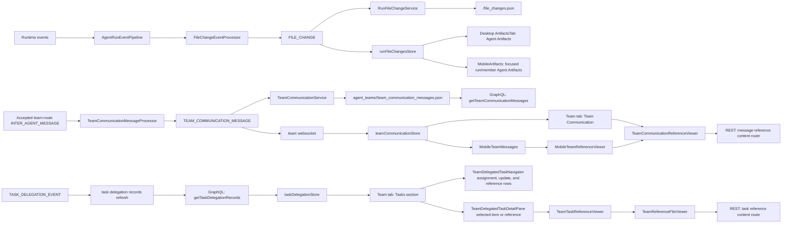

# Agent Artifacts and Team Communication References

## Overview

The desktop and mobile Artifacts surfaces are intentionally run-file-change only.
They list files that the focused agent run produced or touched through explicit
mutation/generated-output runtime events.

Team-route `send_message_to.reference_files` are no longer owned by the
Artifacts tab. They are child rows of Team Communication messages in the Team
tab. The message body stays natural and self-contained; `reference_files` is the
structured attachment/reference list used to register previewable files under the
accepted `recipient_address` message that carried them. Direct exact-run
`send_message_to(target_agent_run_id=...)` messages carry their references in
the target runtime input/event metadata but intentionally do not create Team
Communication reference rows.

Task-delegation `reference_files` are also outside the Artifacts tab, but they
are not Team Communication rows. They are task-owned reference rows normalized
onto persisted `TaskDelegationRecord.referenceFiles`, rendered in the Team tab
Tasks left navigator, and previewed in the right task detail pane. Live
`TASK_DELEGATION_EVENT` messages can refresh the records, but the Tasks surface
is not dependent on transient execution nodes.

## Agent Artifacts

Agent Artifacts cover:

- `write_file`
- `edit_file`
- generated outputs from known output-producing tools (`generate_image`,
  `edit_image`, `generate_speech`, including Agent Tools MCP route-backed
  forms)

Canonical runtime shape:

```ts
interface RunFileChangeEntry {
  id: string; // runId:path
  runId: string;
  path: string; // canonical relative-in-workspace or absolute outside-workspace
  type: 'file' | 'image' | 'audio' | 'video' | 'pdf' | 'csv' | 'excel' | 'other';
  status: 'streaming' | 'pending' | 'available' | 'failed';
  sourceTool: 'write_file' | 'edit_file' | 'generated_output';
  sourceInvocationId: string | null;
  content?: string | null; // transient live write buffer only
  createdAt: string;
  updatedAt: string;
}
```

Rules:

- One row per `runId + canonical path`.
- Team-member produced artifacts remain scoped to the producing member run id.
- Current filesystem content is the source of truth for committed previews.
- `content` is transient and only used for live buffered `write_file` rendering.
- Generic `file_path`/`filePath` fields are not Agent Artifact evidence unless
  returned by a known generated-output tool or paired with explicit
  output/destination semantics.
- `FILE_CHANGE` is a state-update stream, not an exact-one occurrence guarantee.

## Team Communication References

Team Communication owns message references for accepted `recipient_address`
deliveries:

```ts
interface TeamCommunicationProjection {
  teamRunId: string;
  messages: TeamCommunicationMessage[];
}

interface TeamExecutionAddress {
  rootTeamRunId: string;
  taskTeamRunIds: readonly string[];
  memberAddress: string; // rooted AgentTeam address, for example /BuildSquad/review_lead
  taskAgentRunId: string | null;
}

interface TeamCommunicationMessage {
  messageId: string;
  senderAddress: TeamExecutionAddress;
  receiverAddress: TeamExecutionAddress;
  content: string;
  messageType: string;
  createdAt: string;
  referenceFiles: TeamCommunicationReferenceFile[];
}

interface TeamCommunicationReferenceFile {
  referenceId: string;
  path: string;
  type: 'file' | 'image' | 'audio' | 'video' | 'pdf' | 'csv' | 'excel' | 'other';
  createdAt: string;
  updatedAt: string;
}
```

Rules:

- Accepted team-route `INTER_AGENT_MESSAGE` payloads are processor input for Team
  Communication messages. The live/store authority is the derived
  `TEAM_COMMUNICATION_MESSAGE`; direct exact-run messages without team projection
  fields are ignored by this store.
- The durable projection stores `teamRunId` once at
  `agent_teams/<teamRunId>/team_communication_messages.json`; each message uses
  `senderAddress` and `receiverAddress` instead of duplicating sender/receiver
  generated instance ids, legacy member paths/route keys, or compatibility
  wrappers.
- Focused Team Messages compare the focused member's normalized
  `TeamExecutionAddress` with each message's `senderAddress` and
  `receiverAddress`. Task-Agent and task-Team execution identity is carried by
  `taskAgentRunId` and the ordered `taskTeamRunIds`; logical topology remains
  the rooted `memberAddress`.
- Old flat Team Communication projection files are converted by the registered
  app-data migration before normal runtime reads. Runtime, GraphQL hydration,
  WebSocket payloads, and the frontend store do not keep a read-time legacy
  compatibility path for old flat sender/receiver fields.
- Reference rows come only from explicit `payload.reference_files` /
  `payload.reference_file_entries`; message prose is not scanned and raw paths
  are not linkified.
- One durable team-level projection is stored at
  `agent_teams/<teamRunId>/team_communication_messages.json`.
- Reference content opens by message-owned identity:
  `/team-runs/:teamRunId/team-communication/messages/:messageId/references/:referenceId/content`.
- The focused member sees sent/received message perspectives in the Team tab.
  The left list hierarchy is `Sent` / `Received` -> counterpart address label ->
  message -> reference file, without repeated `To` / `From` group prefixes.
- Team Communication rows are compact, email-like rows. The row shell is a
  non-interactive container; message summaries and reference-file rows are
  sibling buttons so reference controls are never nested inside a message
  summary button.
- Selecting a message shows its content in the detail pane through the shared
  Markdown renderer while keeping raw absolute paths as plain text. Selecting a
  reference switches that same pane to the message-owned reference viewer.
- Mobile Team Communication renders the same structured `referenceFiles` as
  tappable phone rows instead of collapsing them to an inert count. Mobile uses
  the same message-owned identity (`teamRunId`, `messageId`, `referenceId`) in a
  full-screen wrapper and returns to the same message list/focused-member
  context on close. Mobile does not scan message prose for paths.

## Task Delegation References

The Team tab Tasks section owns task-delegation references for delegated task
records. Reference rows live in the left task navigator, while selected
reference content renders in the right detail pane:

```ts
interface TeamReferenceFile {
  referenceId: string;
  path: string;
  type: 'file' | 'image' | 'audio' | 'video' | 'pdf' | 'csv' | 'excel' | 'other';
  createdAt: string;
  updatedAt: string;
}
```

Rules:

- Task reference rows come from hydrated `TaskDelegationRecord.referenceFiles`,
  fetched through `getTaskDelegationRecords(teamRunId)`. Live task-delegation
  events can schedule a records refresh and active execution nodes can enrich
  display, but the Tasks UI does not parse Team Communication messages, raw
  Markdown/prose, or transient projection nodes for durable reference paths.
- The left Tasks navigator is one task-owned conversation. It starts with the
  assignment and its references, then renders every submission, review, and
  interruption once in durable record order. Each lifecycle row has a human
  event label, readable participants or system attribution, timestamp, content
  preview, and its own reference rows. The assignment also shows the current
  human task status and last-activity time. The navigator does not duplicate
  the Workspaces execution hierarchy, actor/member rows, or a separate visible
  `References` heading.
- Reference rows use the shared file presentation and a visible selected state.
  Selecting an assignment or update shows only that item's Markdown detail on
  the right. Selecting one of its references switches the right pane to the
  existing file preview; reselecting the owning item returns to its content.
  The right pane never duplicates the lifecycle or reference navigation.
- Reference content opens by task-owned identity:
  `/team-runs/:teamRunId/task-delegations/:taskId/references/:referenceId/content`.
- Raw task/run ids, task-kind and target metadata, routing JSON, raw arguments,
  and the former Technical details disclosure are absent from the Tasks UI.
  Exact ids remain internal selection and reference-routing keys only.
- Tasks is task-content navigation and readback oriented. It never owns
  Approve/Deny controls, approval command target construction, execution focus
  controls, or visible execution-status summary markers; pending approval remains
  Activity-owned.

## Data Flow



## Frontend Owners

| Owner | Path | Responsibility |
| --- | --- | --- |
| Agent Artifact store | `autobyteus-web/stores/runFileChangesStore.ts` | Owns hydrated/live rows for touched files and generated outputs. |
| Agent Artifact stream ingestion | `autobyteus-web/services/agentStreaming/handlers/fileChangeHandler.ts` | Applies `FILE_CHANGE` payloads into the Agent Artifact store. |
| Agent Artifact hydration | `autobyteus-web/services/runHydration/runContextHydrationService.ts` | Loads `getRunFileChanges(runId)`. |
| Desktop Artifacts tab | `autobyteus-web/components/workspace/agent/ArtifactsTab.vue` | Displays only run-scoped Agent Artifacts in the desktop right-side panel. |
| Mobile Artifacts view | `autobyteus-web/components/mobile/MobileArtifacts.vue` | Displays only run-scoped Agent Artifacts for the mobile-selected agent run or focused team member run, using the same run artifact store and `ArtifactContentViewer` rather than the desktop right-panel layout. |
| Mobile focused-run identity | `autobyteus-web/composables/mobile/useMobileFocusedRunIdentity.ts` | Centralizes the mobile agent/team focused run-id guard shared by Activity and Artifacts so stale mobile selections do not leak artifacts or activity from another run. |
| Team Communication store | `autobyteus-web/stores/teamCommunicationStore.ts` | Owns hydrated/live inter-agent messages and focused sent/received message perspectives. |
| Team Communication hydration | `autobyteus-web/services/runHydration/teamCommunicationHydrationService.ts` | Loads `getTeamCommunicationMessages(teamRunId)`. |
| Team Communication panel | `autobyteus-web/components/workspace/team/TeamCommunicationPanel.vue` | Renders compact sent/received message rows, sibling reference-file controls, and Markdown message detail. |
| Team reference viewer | `autobyteus-web/components/workspace/team/TeamCommunicationReferenceViewer.vue` | Opens a reference through the message-owned content route and owns local inline/maximized preview state. |
| Mobile Team messages | `autobyteus-web/components/mobile/MobileTeamMessages.vue` | Renders the focused member's Team Communication messages in the mobile shell and exposes each structured reference file as a tappable phone row. |
| Mobile Team reference wrapper | `autobyteus-web/components/mobile/MobileTeamReferenceViewer.vue` | Wraps `TeamCommunicationReferenceViewer` in a full-screen mobile surface, passes message-owned identity through, and disables rich HTML preview for mobile. |
| Team reference presentation helper | `autobyteus-web/utils/teamCommunication/referenceFilePresentation.ts` | Centralizes reference display-name and icon selection so desktop and mobile Team Communication rows do not duplicate file-type presentation policy. |
| Task Delegation store | `autobyteus-web/stores/taskDelegationStore.ts` | Owns hydrated persisted task-delegation records keyed by root team run. |
| Task Delegation hydration | `autobyteus-web/services/runHydration/taskDelegationHydrationService.ts` | Loads `getTaskDelegationRecords(teamRunId)` for live and historical team runs and supports event-triggered refresh. |
| Shared Tasks section | `autobyteus-web/components/workspace/collaboration/CollaborationDelegatedTasksSection.vue` | Replaces the Team-only section with root-neutral Tasks facets, split layout, local task/reference selection, resizing, and exact participant navigation for Team and AgentOrg roots. Adapters own record projection and reference routes. |
| Team Tasks lifecycle projector | `autobyteus-web/utils/teamDelegatedTaskEntries.ts` | Projects strict task records into an ordered assignment/submission/review/interruption conversation with stable item/reference locators, readable participants, result ordinals, current human task status, and item-owned references. |
| Team Tasks navigator | `autobyteus-web/components/workspace/team/TeamDelegatedTaskNavigator.vue`, `TeamDelegatedTaskLifecycleRow.vue` | Renders the assignment, current human task status, every durable lifecycle update, and each item's reference rows as the complete left-side navigation. It renders no raw ids, routing JSON, execution hierarchy, or Technical details. |
| Team delegated-task detail pane | `autobyteus-web/components/workspace/team/TeamDelegatedTaskDetailPane.vue`, `TeamDelegatedTaskItemDetail.vue` | Renders exactly one selected assignment/update Markdown detail or task reference. Familiar direction names carry exact participant links; optional identity disclosure replaces the permanent top strip. It does not duplicate left lifecycle/reference navigation or own runtime selection. |
| Task reference route wrapper | `autobyteus-web/components/workspace/team/TeamTaskReferenceViewer.vue` | Resolves the root-specific content path supplied by the Tasks facet against the bound node's REST base for the selected task reference; it does not assume a Team root. |
| Task reference preview shell | `autobyteus-web/components/workspace/team/TeamReferenceFileViewer.vue` | Route-agnostic read-only Team reference shell used for task references; delegates raw/preview/media/PDF/CSV/Excel rendering to `FileViewer`. |
| Generic Team reference type/presentation | `autobyteus-web/types/teamReferenceFile.ts`, `autobyteus-web/utils/teamReferences/*` | Shared task-reference file model and file-type/name/icon presentation for the Tasks surface. |

## Viewer Resolution

`ArtifactContentViewer` resolves only Agent Artifact rows. Desktop and mobile
Artifacts surfaces both delegate preview/content loading to this viewer; mobile
remote access therefore keeps using the authorized run content route instead of
opening workspace files directly.

1. Live `write_file` row with `streaming` or `pending` status -> buffered inline
   `content`.
2. Failed row -> explicit failure state.
3. Non-`available` row -> pending state.
4. Available row -> `/runs/:runId/file-change-content?path=...`.

Team Communication reference previews use `TeamCommunicationReferenceViewer` and
never use the run-file-change route. The message viewer owns its local
maximize/restore state independently of Agent Artifact display-mode controls:
users can open the preview inline, maximize it to a viewport shell, restore with
the control or `Escape`, and keep switching between Raw and Preview while
maximized. The mobile wrapper uses the same viewer/content route in a
phone-sized full-screen surface, but disables rich HTML preview so mobile
reference files stay on authorized raw/Markdown/media/PDF/CSV/Excel loading
paths rather than an unauthenticated static HTML preview path.

Task-delegation reference previews use `TeamTaskReferenceViewer` and
`TeamReferenceFileViewer`. The route identity is task-owned
(`teamRunId + taskId + referenceId`), not message-owned, and the preview occupies
the Tasks right pane until the task navigator selects the task summary or
another reference. The generic task reference shell uses authorized fetch/object
URLs and the shared read-only `FileViewer` modes for text/Markdown, protected
media, PDF, CSV, and Excel content.


## Uploaded Context Files Versus Collaboration References

Uploaded user context files retain their recorded URI/type/name through raw
trace, initial/cold/earlier-page projection and shared UserMessage hydration.
They are not a new task artifact family. Org uploads are owned by root plus
exact AgentRun; message/task reference URLs remain separately root-owned. Open
uses saved ownership, not the current viewer or configured source at the same
address. Separate text/JSON links remain accepted existing presentation.

One accepted standalone native first-Send chip can retain a draft URL404 until
reload/reselect yields final200 and exact stored bytes (API-FIND-040). This is
not fixed or a durable-loss finding. See the task branch's archived
`known-issues.md`; do not infer that passing retained-file checks prove this live
chip path correct.
