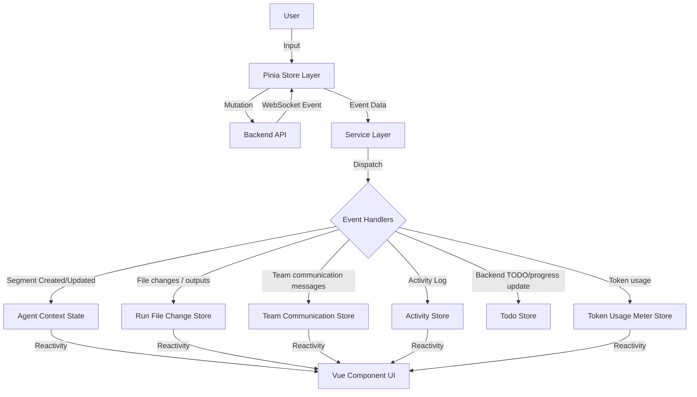

# Agent Execution Architecture

## Overview

This document outlines the end-to-end architecture of how Agent and Agent Team executions are managed in the frontend. The architecture has evolved to offload complex parsing to the backend. The frontend now acts as a **Renderer** of structured events rather than a parser of raw text.

## Provider Credential Settings

Settings -> API Key Management is a write-only credential surface backed by the
server's centralized encrypted vault:

- `providerCredentialSettings(runtimeKind)` returns each provider once with its
  descriptor, `catalogMode = STATIC | DISCOVERED`, and one provider-owned
  `apiKeyConfigured` fact. It does not read or wait for model discovery;
- `providerModelCatalogSnapshots(runtimeKind)` independently returns the
  current in-process LLM, audio, image, and video rows plus source state. The
  snapshot read initializes curated/static registries without network access
  and never starts a dynamic source;
- stored credential values are never returned;
- ordinary built-in providers support Save/create-or-overwrite and value-free
  configured status, with no standalone credential-removal action;
- Gemini uses its specialized three-option Settings flow for Save/overwrite,
  first-time Save-and-use, and Use-this-mode;
- Gemini initially renders three compact option rows. Configure expands and
  focuses exactly one editor at a time. Key inputs remain write-only password
  fields, the visibility control affects only the transient typed value, and a
  successful save clears that input;
- Qwen uses a dedicated Base URL + API-key form rather than the ordinary
  built-in key-only editor. Both values are required; the URL must be absolute
  HTTP(S), and the server probes its `/models` contract before persistence. The
  key stays write-only and is cleared after a successful committed mutation;
- Qwen renders the server-owned `DEFAULT` or `CONFIGURED` endpoint source and
  value-free key status. It never infers configured state by comparing the
  effective URL with a frontend default. A failed durable URL commit reports
  that the previous pair was restored; the bounded double-failure result tells
  the user to save a valid pair again before using Qwen;
- configured and active state are value-free badges derived from the
  authoritative setup state and remain accurate after a Settings reload; and
- successful credential/setup commands return the updated value-free setting
  (and specialized Gemini/Qwen setup state) so the client applies committed
  state directly without refetching or awaiting a catalog operation.

API Keys starts the credential read and local catalog snapshot independently,
but it awaits only the credential read before rendering provider navigation and
the selected credential editor. Static providers show curated rows immediately
and never show Reload. `AUTOBYTEUS`, `OLLAMA`, `LMSTUDIO`, and saved custom
providers are `DISCOVERED`: selecting a cold source starts only that provider's
`ensureProviderModelCatalog` operation. A later read reuses its in-process
snapshot; only provider-local Reload forces `reloadProviderModelCatalog`. There
is no page-level, global, static-provider, or all-capability Reload operation.

Dynamic progress and failure stay inside the selected model section. Source
state distinguishes `IDLE`, `LOADING`, `READY`, `PARTIAL`, `REFRESHING`,
`STALE_ERROR`, and `ERROR`. Credential controls remain available during model
loading/failure; current rows remain visible while refreshing; retained rows
use stale copy only after their own failed refresh; and a partial response with
no rows is unavailable/partial rather than an authoritative empty catalog.

A successful Qwen mutation is the committed setup result. The client then
applies the returned setup and credential setting directly. Qwen's static
catalog (`qwen3.7-max`, `qwen3.8-max`, `deepseek-v4-pro`,
`deepseek-v4-flash-0731`, `glm-5.2`, and `qwen3-max`) does not require endpoint
discovery or Reload. Catalog rows show the friendly names `DeepSeek V4 Pro (Qwen)`,
`DeepSeek V4 Flash 0731 (Qwen)`, and `GLM-5.2 (Qwen)` across Settings and the
shared agent, team, application/member, and binding selection paths. Their
option values remain the collision-safe `qwen:...` model identifiers, and Qwen
provider requests continue to send the exact unprefixed model values. A stored
selector missing from the current catalog remains visible by its raw identifier
for repair instead of receiving a guessed friendly name. If a subordinate
operation fails, the UI keeps the committed configured state rather than
relabeling the save as failed. The removed `qwen3.8-max-preview` value must not
reappear after save, catalog read, or recovery.

An ordinary AutoByteus credential save returns after the vault commit. The
server invalidates and starts only the AutoByteus LLM/audio/image sources in the
background, and the mounted client separately starts or joins the matching
non-forcing ensure after it has published credential success. Neither side
turns the credential command into an awaited global refresh.

Custom OpenAI-compatible provider drafts still accept an API key for the probe
and create transaction, but only non-secret provider metadata is persisted in
the strict V3 custom-provider JSON file. The server derives an immutable
readable ID from the normalized name (for example `provider_alibaba_cloud`) and
atomically rejects invalid names or canonical-name/ID collisions; the browser
does not submit an ID. The credential is stored separately, and deleting the
custom provider through the provider-entity lifecycle removes both its
credential and metadata. AutoByteus gateway models retain their downstream
display provider while credential configuration remains owned by the
`AUTOBYTEUS` gateway provider.

An upgrade from legacy UUID providers deliberately resets provider records,
Base URLs, and credentials after migrating only exact allowlisted selector
prefixes. The user recreates each desired provider through the same custom
provider form with name, Base URL, and a new key. Reusing the same canonical
name regenerates the readable prefix embedded in migrated selectors; a changed
name or missing model suffix requires manual reselection. During the
provider-absent interval, saved selectors remain visible as unavailable and
block launch/resume instead of silently clearing or falling back. In
particular, application agent launch profiles retain the raw missing value and
show unavailable guidance until the user selects an advertised model.

See `autobyteus-server-ts/docs/modules/secret_management.md` for encrypted-vault,
migration, runtime resolution, Claude authentication, and real-E2E operator
contracts.

## Server Settings: Working-Context Compaction

Settings -> Server Settings -> Basics contains the global Compaction card. Its
strategy selector is registry-backed and node-bound:

- `getWorkingContextCompactionStrategies` supplies available `{ id, name }`
  options from the bound server;
- `getEffectiveWorkingContextCompactionStrategyId` supplies the normalized ID
  runtime will attempt and is the card's clean baseline; and
- generic server settings supply trigger ratio, active-context token override,
  and detailed-log values.

Absent or blank strategy configuration is returned as effective
`structured-json` without writing that default merely because the card loaded or
another field was saved. An explicit unknown ID remains visible as unavailable
until the user selects a catalog option. Catalog or effective-read failures keep
strategy selection unavailable and expose Retry rather than guessing from a web
constant or catalog order.

Save builds a deterministic list of changed valid fields and awaits the existing
one-setting mutation for each key. It stops on the first failure; prior successful
writes remain authoritative, while the failed and unsent drafts stay dirty for a
remaining-only retry. The card never claims transactionality or whole-card
success after a partial failure. Initial settings-read failure is owned by the
Server Settings manager and also provides an accessible Retry path.

The Compaction card does not fetch agent definitions or expose a compactor-agent
selector. `structured-json` uses the server's fixed built-in Memory Compactor and
inherits its blank runtime/model launch fields from the parent run. The card
stacks navigation/content and uses full-width controls on narrow screens while
retaining the desktop sidebar row.

## Server Migrations: Status Evidence

Settings -> Server Migrations consumes the server-owned migration-record
projection. A completed attempt exposes one nullable plain-text summary in the
canonical form `Scanned N; migrated N; skipped N; failed N.` together with its
status, attempt/timing metadata, concise error, and detailed-log path. A record
with no terminal attempt may have no summary.

The table renders that summary as opaque text; it does not parse counts, accept
the released `summary_json` shape, or expose expandable item details. The
runner's per-attempt filesystem log remains the detailed evidence destination:
it contains the four counts and every item diagnostic returned by the
migration definition, while the database, GraphQL response, store, and Settings
table stay independent of source cardinality. The displayed `logPath` is a
reference only; the frontend does not read or validate historical log files.

## Server Migrations: Recovery Actions

Settings -> Server Migrations renders recovery policy supplied by the server;
it does not derive policy from migration IDs, statuses, or execution metadata.
Each migration status carries one action:

- `MANUAL_RETRY`: Retry is enabled and dispatches the existing retry mutation;
- `RESTART_TO_RETRY`: Retry stays disabled, no mutation is dispatched, and the
  card shows localized guidance that AutoByteus must be restarted for another
  ordinary startup attempt; or
- `NONE`: no retry action or restart promise is presented.

The restart-only guidance is available in English and zh-CN. It describes the
actual startup runner path, not a frontend workaround: a failed or stale
required startup-only migration may run on the next ordinary application
startup, while direct manual execution remains unavailable. Transport and UI
state retain the non-null server action; `canRetry` remains true only for
`MANUAL_RETRY`.

## Server Settings: Live Response Streaming

Settings -> Server Settings -> Basics contains a node-bound **Live response
update interval (ms)** card. It controls the sole normal WebSocket content
cadence on the server selected by the current window; it is not a per-agent,
per-team, runtime, provider, or frontend-renderer preference.

- `getEffectiveStreamingContentFlushIntervalMs` returns the bound server's
  effective value. An absent or invalid direct configuration resolves to the
  recommended default of 500 ms without writing configuration merely because
  the card loaded.
- Save accepts only whole milliseconds from 100 through 2,000 and persists the
  canonical `AUTOBYTEUS_STREAMING_CONTENT_FLUSH_INTERVAL_MS` setting through the
  existing server-setting mutation. Reset writes 500 ms.
- A successful change affects the next newly opened content window on active
  and future streams without restarting the application or server. A window
  already in flight keeps the interval captured when it opened.
- The value configures the pipeline's one content scheduler only. The same
  per-connection pipeline also forwards first/changed `AGENT_STATUS` payloads
  and suppresses exact repeats by enriched standalone/member/task identity;
  that status policy is not a user-tunable cadence setting. Reconnect creates a
  fresh status baseline, and canonical runtime subscribers remain unfiltered.
- Smaller values display live progress more frequently; larger values reduce
  transport and UI update work. The frontend adds no second cadence timer.
- Loading, mutation, validation, and unavailable-node failures remain explicit.
  Rebinding the window reads the newly bound server's effective value, so two
  nodes can legitimately retain different settings without cross-node leakage.

The data flow follows a top-down approach:

1.  **Orchestration Layer (Stores)**: Manages lifecycle, user input, and WebSocket streaming connections.
2.  **Service Layer (Event Routing)**: Dispatches incoming structured WebSocket events to specific handlers.
3.  **Segment Processing (Handlers)**: Updates the reactive `AgentContext` and sidecar stores based on event payloads.

---

## Level 1: Orchestration Layer (Stores)

The Pinia stores act as the primary interface for the UI components to interact with the agent backend. They are responsible for initiating actions (Mutations) and listening for updates (WebSocket streams).

### `agentRunStore.ts` (Single Agents)

- **Role**: Manages the execution lifecycle of individual agents.
- **Key Actions**:
  - `sendUserInputAndSubscribe()`: After validation, immediately begins a local user submission by appending the user message, clearing the composer/staged context files, and setting `isSending`. For a new temporary run it calls `PrepareAgentRun` to create a durable prepared run identity without starting runtime, promotes the local context to that run id, finalizes attachments, opens the WebSocket stream, and sends `SEND_MESSAGE` with required `message_id` / `dedupe_key`. Existing inactive runs do not call `RestoreAgentRun` before send; backend `SEND_MESSAGE` owns restore/start/send lifecycle. Finalized attachment locators are reconciled onto the already-visible local message rather than appended as a duplicate. The visible lifecycle status remains backend-owned and comes from streamed `AGENT_STATUS` / `AGENT_COMMAND_ACK.status` payloads, not a frontend lifecycle placeholder.
  - `connectToAgentStream(runId)`: Listens for real-time events specific to an agent run via WebSocket. For standalone runs, connect attaches to a durable run identity and receives backend status projection without forcing runtime restore; the later `SEND_MESSAGE` command performs backend-owned activation/restore when needed.
  - `interruptGeneration()`: Generates a fresh `client_interrupt_*` command id and asks `AgentStreamingService` to admit the backend `INTERRUPT_GENERATION` control command. Its boolean result means connected-socket admission only. A matching rejected/failed server result or local not-connected/send/disconnect completion produces one localized error toast; accepted produces no success toast or optimistic idle. `isSending` is cleared only by later backend lifecycle/status handling after the runtime settles the active turn.
  - `terminateRun(runId)`: Sends backend `TerminateAgentRun` for persisted runs before local teardown, then disconnects the stream, marks the run inactive in history, and refreshes the history tree. Row-level terminate actions delegate here without selecting the row; follow-up chat recovery still uses the restore-aware send path rather than treating terminate as a local-only close.
  - `postToolExecutionApproval()`: Sends user decisions (Approve/Deny) for "Awaiting Approval" tool calls through the backend active-runtime approval command; it is not a restore or turn-starting operation.
  - `closeAgent()`: Cleans up local state and unsubscribes.

### `agentTeamRunStore.ts` (Agent Teams)

- **Role**: Owns Team launch, restore, exact execution focus, Team stream
  attachment, message submission, interrupt, and termination.
- **Key Actions**:
  - `launchDraft()`: synchronously admits the selected immutable draft before
    allocation, validates rooted member-address launch readiness, creates the
    backend TeamRun, hydrates its canonical topology/execution state, transfers
    draft inputs, promotes the draft exactly once, and releases the launch lock
    on success or failure. Pending edits, focus/input/workspace/removal/clear,
    selection changes, and duplicate launch allocation are rejected.
  - `connectToTeamStream(rootTeamRunId)`: attaches one `TeamStreamingService` to
    the root TeamRun and its canonical `AgentTeamContext`. Transport readiness is
    separate from root Team liveness and leaf Agent status. The service accepts
    the initial structural snapshot as its sequence base and then requires exact
    next-sequence admission for every live execution message. The first gap is
    rejected before Team or Agent conversation mutation, enters the persistent
    `reopen_required` phase once, closes the stale transport, and blocks commands
    and ordinary reconnect rather than silently dropping later output.
  - Team-stream recovery is an explicit history-selection workflow, not a
    structural-snapshot refresh. Reselecting a member performs a root execution
    checkpoint, exact per-Agent conversation hydration, and a second checkpoint;
    open work or a changed checkpoint produces localized wait/retry feedback and
    leaves the failed context selected. Only a candidate stream whose snapshot
    base equals the stable checkpoint can atomically replace the failed service
    and fully hydrated context.
  - `sendMessageToFocusedMember()`: uses the focused exact
    `TeamExecutionAddress` (`rootTeamRunId`, ordered `taskTeamRunIds`, rooted
    `memberAddress`, and nullable `taskAgentRunId`). It launches or restores when
    necessary, requires an exact Agent execution, begins one local submission,
    finalizes attachments, and emits `SEND_MESSAGE` with `execution_address`,
    required `message_id`, and required `dedupe_key`. Invalid, stale, non-Agent,
    or cross-root identity fails closed; there is no structural-template,
    route-key, display-name, or generated-id fallback.
  - `interruptFocusedMemberGeneration()`: emits `INTERRUPT_GENERATION` with a
    fresh command id and the exact execution address. `TeamStreamingService`
    completes the pending command only when `AGENT_COMMAND_ACK` matches both.
    Accepted acknowledgement is admission, not an optimistic status change.
  - `postToolExecutionApproval()`: reuses the exact execution address captured
    from the authoritative `agent_execution` event. It never rebuilds a target
    from current focus or invocation-id/display aliases.
  - `terminateTeamRun()`: calls backend termination before local teardown for a
    persisted TeamRun and preserves the active local state on failure.

### Stopped-Run Follow-Up Recovery

Single-agent and team follow-up chat share the same backend-owned recovery
principle, but the standalone runtime activation boundary is now the
`SEND_MESSAGE` command:

- frontend single-agent stores do not call `RestoreAgentRun` as a send precondition; team stores may still use the team restore/resolve path owned by the team container;
- standalone WebSocket connect can attach to an inactive durable run identity without restoring it, and standalone `SEND_MESSAGE` is the backend-owned recoverable command that publishes `initializing`, restores/activates, and forwards the message;
- team WebSocket connect and `SEND_MESSAGE` remain restore-aware through the team container, so follow-up chat can still recover stopped-but-persisted team runs when the frontend cache is stale, missing, or was updated after a local stop;
- accepted follow-up messages mark the run/team active in run history and refresh the history tree; and
- interrupt/tool-approval control messages are active-only and should not be used as implicit restore operations.

Tool approval controls use the selected active context only. Inline approval
buttons route `APPROVE_TOOL` / `DENY_TOOL` through the appropriate streaming
service. For Team streams, each tool event carries a strict `agent_execution`
binding. `TeamToolApprovalTargetTracker` captures its exact
`TeamExecutionAddress` by invocation id, and approval/denial serializes
`{invocation_id, execution_address, reason}`. A focus change cannot retarget the
command. Missing or malformed execution identity fails closed; the frontend does
not reconstruct it from member paths, route aliases, generated instance ids, or
invocation ids. Authoritative lifecycle remains the backend's later
`TOOL_APPROVED`, `TOOL_DENIED`, `TOOL_EXECUTION_*`, `ERROR`, and status events.
A visible tool card is not by itself approval authority.

Interrupt dispatch and interrupt result are control traffic, not lifecycle or
transcript events. Both streaming services register the fresh command id and
exact target before send, reject non-connected states locally, roll back a
synchronous send failure, and delete-guard acknowledgement/disconnect completion
so each admitted command completes at most once. Team acknowledgement matching
runs before member/task projection. A rejected/failed result or local transport
failure creates one target-aware toast; it does not append an `ErrorSegment`,
change agent/member/root activity, retry, or fabricate a server acknowledgement.
An accepted result means provider/runtime admission only. The frontend keeps the
affected single run or focused team member in its current sending state until
`TURN_COMPLETED`, `AGENT_STATUS`, or terminal stream handling clears that state,
so Stop remains visible until the provider cancellation boundary has settled.

### Runtime Status And Interrupt Authority

The frontend lifecycle model deliberately separates leaf status, root liveness,
and transport state:

- single-agent and exact leaf-agent status uses `offline`, `initializing`, `idle`, `running`, and `error`;
- single-agent `AGENT_STATUS` payloads are
  `{ status: "offline" | "initializing" | "idle" | "running" | "error", can_interrupt: boolean, agent_id?, agent_name? }`;
- root team liveness uses `TEAM_RUN_LIFECYCLE { team_run_id, is_active }` and is
  stored as `AgentTeamContext.isActive`;
- WebSocket connection state is stored separately as `AgentTeamContext.isSubscribed`;
- team member interrupt authority comes from the selected member's most recent
  `AGENT_STATUS.can_interrupt` value, never from root liveness; and
- legacy transition-field names and detailed runtime
  phases such as `bootstrapping`, `awaiting_llm_response`, or `executing_tool`
  are not part of the frontend WebSocket status contract.

Runtime adapters may still use richer provider/native status internally. The
server boundary projects those details into the coarse API status and computes
`can_interrupt` from the runtime-owned active-turn/snapshot source. `isSending`
remains a local submit-flight and disabled-input signal only; it must not be
used to show the stop button or to infer that an interrupt can be accepted.
When the backend accepts a standalone `SEND_MESSAGE` command for an inactive or
prepared run identity, `AgentRunCommandCoordinator` is responsible for
publishing non-interruptible `initializing` before slow restore/start/activation
work; the frontend displays that streamed status or `AGENT_COMMAND_ACK.status`
instead of inventing a lifecycle placeholder. Restored runtime readiness or a
restored status snapshot is not a frontend-visible replacement for this
overlay; keep showing backend `initializing` until command-correlated
`TURN_STARTED`, `AGENT_STATUS`, terminal/error, or coordinator failure evidence
arrives. When the backend accepts a
focused team-member command for an `offline` or `idle` member, the team backend
publishes member-scoped non-interruptible `initializing` before slow member
startup/send work.
Startup tokens such as `bootstrapping`, `starting`, `startup`, `initializing`,
and active `uninitialized` project as active non-interruptible
`initializing`; they keep send readiness blocked without granting the red
interrupt affordance. Active processing/tool/LLM tokens project as `running`.
When the selected context is a Team, text send and stop/interrupt dispatch use
the same focused exact `TeamExecutionAddress`, but remain separate commands.
`SEND_MESSAGE` carries that address with message/dedupe identity;
`INTERRUPT_GENERATION` carries it with a fresh command id. The focused address
must resolve to an exact Agent execution in the current root TeamRun. Missing,
stale, structural-Team, or cross-root targets are rejected locally or by the
strict server boundary instead of falling back to another member. Tool approval
uses the execution address recorded for the invocation rather than current focus.

Run-history refresh, active recovery, and run-open hydration must preserve an
already-live `initializing/canInterrupt=false` or `running/canInterrupt=true`
single run or focused team member while that live stream remains authoritative,
but terminal `offline` or `error` history projections must clear stale
`canInterrupt` even when a caller asks to preserve live interrupt state. A later live
`AGENT_STATUS { status: "idle", can_interrupt: false }` likewise revokes the
browser-visible stop affordance.

Active team recovery and refresh must keep root liveness, transport state, and
member status separate. `isActive=true` does not imply that any particular
member is `running` or `initializing`; members keep their own scoped status or
default to `offline/canInterrupt=false` until an exact `AGENT_STATUS` arrives.
Frontend reconciliation must never fan root activity out to member rows.

Workspace presentation may render that binary root fact without restoring a
team status model. `TeamActivityDot.vue` accepts only `isActive` plus localized
accessible copy. Each exact history or running team-run row passes only that
run's authoritative `isActive`: active is a solid blue dot, inactive is a solid
gray dot, and neither state pulses or encodes a five-state lifecycle. A rendered
team-definition group derives a presentation-only `hasActiveRuns` value from
`runs.some(run => run.isActive)` over the exact child runs it displays. That
any-active cue remains visible while the group is collapsed, reacts when the
last active child becomes inactive, and is not a persisted/transported
definition field. Representative ordering, leaf-agent status, socket
subscription, and Stop/pending state must not influence either the exact-run
cue or the group projection.

Delegated task executions are task-scoped execution projections rather than
structural topology. Every Team Agent event carries one `agent_execution`
binding with `kind`, exact `execution_address`, and an `agent_run_id` only when
that execution owns an Agent runtime. A task-Agent address keeps the rooted
logical member and sets `taskAgentRunId`; a task-Team child appends the concrete
child TeamRun id to ordered `taskTeamRunIds` and carries the rooted child Agent
address. The strict contract contains no task instance ids, execution-kind
aliases, member/source path or route-key fallbacks, represented-subteam fields,
or generated-run-id inference. Complete task snapshots and live events reconcile
through the same execution model and exact serialized address.

Delegated task visibility is intentionally split across two surfaces. The
global Workspaces/run-history tree owns live execution identity and hierarchy:
it composes stable history rows with pure renderer-only transient display rows
from the V2 execution view in `AgentTeamContext.view`, keeps durable members
visually solid, and renders task-agent, task-team root, and task-team child
executions inline with explicit transient row kinds. Stable configured Team
rows use an unboxed filled user-group icon and semibold name, while stable Agent
rows retain their circular avatar. A transient task-Team row uses one dashed
indigo row treatment plus a bordered bolt icon; a transient task-Agent keeps the
eight-dot `StatusDot` variant so its exact status color remains visible. Neither
role adds visible `Temp` / `Temporary` copy to the row body.

`WorkspaceTeamExecutionTree.vue` applies the existing local disclosure state to
the depth-first execution projection and derives sibling continuation metadata.
`WorkspaceHierarchyBranches.vue` renders continuous ancestor rails and a
right-only current elbow from that metadata; the current vertical continues to
the next sibling or stops at the current row midpoint for the last sibling.
These branches are presentation-only and do not create or rewrite topology.
Selecting either a stable or transient Workspaces row uses the existing
team-member inspection path. `TeamExecutionViewState` is the sole authority for
the focused exact Agent execution; the run-history navigation projection derives
its current row from that view only after inspection succeeds. A team-member row
is current only when its owning `teamRunId` is the authoritative selected TeamRun
and the view's exact focused AgentRun matches that row. An address alone must not
select the same placement in another historical TeamRun, and navigation code must
not patch a second focus value. Stable and transient current rows expose the
single `aria-current="true"` navigation state, while focus, hover, status, and
transient presentation remain separate visual states. The right-side Team tab
owns task detail/content through its Tasks section; it is not the primary
execution hierarchy or status surface.

Mounted task contexts are not automatically retained-projection authority. A
live activation may materialize the exact task AgentRun with default empty and
`offline` presentation before its retained conversation and Activity are loaded.
Selecting such a row keeps the previous coherent row current, shows row-scoped
loading state, and single-flights `GetTeamMemberRunProjection` for the exact root
TeamRun and AgentRun. The hydration service stages conversation and Activity,
then applies them only when the root context, Agent context, event-monitor
revision, and Activity revision still match. A conflict retries rather than
overwriting newer live state; a terminal error keeps the prior focus and exposes
a retry action. A successfully loaded zero-item projection is the only
authoritative empty state.

Fresh Team open follows the same invariant: an explicitly requested focus must
exist and its exact projection is fail-fast, while nonfocused projections remain
best effort. The open coordinator commits the staged projection and Activity
batch before mounting, selecting, or connecting the stream. Snapshot/reconnect
processing invalidates retained-projection authority. Task settlement preserves
focus when it remains visible; when focus repair chooses a different AgentRun,
the stream path immediately reconciles that fallback's exact projection before
its monitor is treated as authoritative.

The retained projection is only the exact first-inspection baseline. For a
newly delegated task Agent, the root Team stream publishes
`TASK_AGENT_ACTIVATED` before every exact task-Agent frame. The server buffers
pre-activation Agent events behind a registry-owned durability gate, drains them
FIFO after durable activation, including synchronous reentrant events, and then
forwards later status, turn, content, tool, and segment events exactly once.
Abort/disposal publishes nothing and starts no assignment work. The frontend
routes released frames by exact `agent_execution`, allowing an already-selected
task monitor, Activity, and execution status to advance without reload/refocus
while repeated same-address task runs remain isolated. Reconnect snapshots are a
recovery authority, not the normal continuation path.

The expanded execution subtree exposes localized `tree` and `treeitem`
semantics. Every row reports its localized role, name, exact address, level,
status, selection, and applicable expanded state; row bodies and independent
disclosures remain operable with pointer, Enter, and Space without disclosure
clicks bubbling into selection. A native title and focus-visible tooltip recover
the complete role/name/address when a label truncates. The
`workspace-history-panel` container preserves the supported 260/320/520px and
Default/Large/Extra Large matrix: repeated member age yields at 320px and below,
depth-2 status may yield below 280px, and hidden metadata returns on hover or
keyboard focus. Selected execution rows keep a straight 2px indigo inset rule,
`#eef2ff` background, and zero corner radius so selection does not erase the
tree grammar or node role.

`TeamOverviewPanel` owns the local Messages/Tasks accordion state. Messages
remains the default for a selected team run with no delegated task entries, but
the panel opens Tasks automatically when the selected team run already has
persisted delegated task entries or when a new delegated-task identity appears
while the same run is mounted. The auto-open signature is derived from the same
`deriveDelegatedTaskEntries(...)` entries consumed by
`TeamDelegatedTasksSection`, keyed by persisted task id and live execution
identity when available, so unrelated messages or refreshes do not open Tasks. A
user may still collapse Tasks for the same task set; the panel reopens only for
a different delegated-task signature or a selected-run change to a run that has
delegated tasks. When the selected team run changes and there are no delegated
tasks, the panel opens Messages.

`TeamDelegatedTasksSection` derives entries from persisted task-delegation
records in `taskDelegationStore`, filtered by the focused sender/receiver
address perspective. Live task-agent/task-team projection nodes in
`AgentTeamContext` are optional enrichment for matching records and provisional
visibility for not-yet-refreshed live tasks; they are not the durable display
source. Opening or reloading active and historical team runs hydrates records via
`getTaskDelegationRecords(teamRunId)`, and live task-delegation websocket events
schedule a debounced records refresh.

Inside that section, `deriveDelegatedTaskEntries(...)` projects every current-
schema task record into one ordered conversation: the assignment root followed
by every submission, review, and interruption in the record's durable update
order. Submission ordinals and review-to-submission linkage are derived from the
strict record instead of inferred from display text. A task-Team submission is
attributed to the readable task Team because the record does not identify a
more specific submitting member; the UI must not invent one.

`TeamDelegatedTaskNavigator` keeps that complete conversation on the left. The
assignment row shows its description, readable delegator-to-assignee direction,
last-activity time, and one human lifecycle badge: In progress, Awaiting review,
Revision requested, Accepted, or Interrupted. Each update appears exactly once
below the assignment as a selectable message-style row with a localized event
label, result ordinal when applicable, readable direction or system attribution,
timestamp, content preview, and only that item's reference rows. Assignment and
update references have visible selected state and no separate visible
`References` heading.

Assignment, update, and reference clicks update only exact section-local
selection keys. A live full-record replacement retains the selected item or
reference while its stable identity still exists; otherwise selection falls
back to that task's assignment. These actions must not focus the center
conversation/composer, replace it with a task team card, or repeat the Workspaces
execution hierarchy. The Tasks UI does not render raw task/run ids, routing JSON,
target-kind metadata, raw arguments, a Technical details disclosure, responsible
actor/member hierarchy rows, `Focus agent` / `Focus team` controls, or approval
controls. Exact ids remain internal selection and reference-routing keys only.

`TeamDelegatedTaskDetailPane` renders exactly one selected assignment/update
detail or one selected task-owned reference preview. Item detail uses a readable
localized title, direction, timestamp, Markdown content, and the assignment's
current human status when the assignment is selected. The right pane does not
duplicate the lifecycle timeline, reference navigation, actor roster, focus
controls, or removed technical metadata. Messages remains an independent,
unchanged message-owned surface.

The global Workspaces/run-history tree remains the navigation and execution-focus
surface for workspaces, runs, teams, durable members, and live transient
execution identities. `runHistoryStore` owns one cached, indexed navigation read
model that includes completed stable-plus-transient `executionRows`; its
focused-member presentation is derived from the owning
`AgentTeamContext.view`. Components consume those rows rather than reading live
contexts or rebuilding rows per workspace, but the cached projection is never an
independent focus authority. The
projection may reuse the shared status-dot presentation for workspace rows and
stable member rows, but transient task executions remain navigation-only rows
rather than ordinary durable `TeamMemberTreeRow` history rows. Transient
task-team roots with child rows are collapsed by default; their
user-controlled disclosure state is keyed by the transient execution row identity
so simultaneous task-team executions do not accidentally share expansion state.
When a transient task-team row has children, activating the row body toggles that
identity-keyed disclosure state while also selecting/focusing the transient row;
the explicit disclosure control remains a stopped toggle-only target.
Each task-Agent row also renders a textual task-lifecycle label alongside the
exact Agent execution-status label. The selected task header exposes the same
two independent dimensions plus a visible Task marker. Lifecycle values come
only from the task record (`In progress`, `Awaiting review`, `Revision
requested`, `Accepted`, or `Interrupted`); execution values come only from the
Agent status (`Initializing`, `Running`, `Idle`, `Error`, or `Offline`). Message
wording, Activity, ordinary handoffs, and idle status never imply task
completion.
Workspaces must not render delegated-task summary blocks, task reference rows,
raw task arguments, approval controls, or delegated-task Technical details.
Tasks is not an approval action surface: pending approval can appear only as
non-actionable human task context there, and Activity remains the owner for
Approve/Deny controls and approval command routing. Task reference
files come from persisted task-delegation records and open in the Tasks right
pane through the task-owned reference route; Messages remains message-owned and
its content/reference UX is not routed through task identity.
The center workspace remains the focused conversation/event/composer surface and
must not render `TeamActiveTaskExecutionsBar` or any replacement center list.

Running and awaiting-acceptance task executions must remain visible as
Workspaces transient identity rows and as Team → Tasks detail entries after
active team reopen/hydration when live projection is present. Persisted delegated
task records must remain visible in Team → Tasks for active, accepted,
awaiting-review, and historical tasks even after those transient runtime rows
settle, disappear, or the backend restarts. Run-open hydration therefore loads
root-run task records and uses live projection/identity only as enrichment
instead of collapsing tasks into the logical member or team parent.
Stream routing is projection-first: task-team root/scoped child identity wins before
task-agent identity, then exact logical route/path identity, then compatible
run-id fallback. The frontend must not recreate the removed `isTaskAgentRunId`
generated-run-id heuristic or any other run-id-format parser as a routing
authority. After delegator acceptance and backend settlement or offline cleanup,
the frontend removes the transient task execution root, scoped children, and
nested task-agent projections while preserving the structural member/team
topology and the history that records the delegated task completion.

When a single-agent run is terminated successfully, the backend publishes
`AGENT_STATUS { status: "offline", can_interrupt: false }` to the already-open
stream before teardown. Frontend live state and history merge logic should treat
`offline` as the canonical inactive non-error terminal state instead of waiting
for a socket close or a later history reload to infer that transition.

### Compaction Lifecycle Activity And Center Feed

Native AutoByteus memory compaction status is projected as Activity lifecycle
state first. The right-side Activity panel should retain the full compaction
operation identity and phase progression, including requested/queued,
execution, terminal success/failure, timestamps, and surrounding tool-result
detail. That lifecycle row is diagnostic/runtime feedback; it must not become
LLM-facing text and must not replace the backend memory artifact contract.

The center conversation feed is narrower. Requested/queued compaction phases are
internal scheduling states and stay out of the center feed so a pending
tool-call turn is not split before tool results arrive. The first
center-eligible execution phase for a compaction operation marks the current
frontend assistant visual block complete, allowing the `Memory compacted` row to
appear after the tool-call/result block and before the post-compaction assistant
continuation. Completed/failed execution rows may be shown in the center feed;
requested/queued rows must not.

Historical run reopen uses the backend replay bundle as the display source for
actual user, assistant, reasoning, and tool trace content. Normal Event Monitor
projection reads only the active raw-trace file, reconstructs its lifecycle
evidence, and selects its newest 100 canonical replay events; it does not open
archived raw-trace segments. Native compaction projection cards are
intentionally live-only center feedback in this slice: reopened historical
conversations should replay that active-file recent window and should not
synthesize center compaction cards from compaction lifecycle/status entries.
Archived segments and manifests remain unchanged and directly usable by their
own storage lifecycle. The Event Monitor never pages into those archives; its
explicit earlier-browsing path is bounded to the current active trace.

Native AutoByteus memory ingestion persists every non-empty completed reasoning
value as a distinct replay-authoritative `reasoning` raw trace immediately
before its ordinary assistant trace. The pair shares turn, source-event, and
timestamp identity while retaining unique trace IDs and monotonic sequence
order; working-context provenance references both. The existing standalone and
team replay transformers therefore hydrate reasoning and assistant rows in
order, allowing Thinking to survive history reopen, hard reload, and member
reselection. Pre-contract raw traces that omitted reasoning remain readable but
incomplete; the product does not rewrite them, infer reasoning from ordinary
assistant narration, or fall back to working-context snapshots.

### Run Reopen Projection Hydration

Run-history reopen consumes a backend replay bundle with sibling
`conversation` and `activities` projections. Frontend open coordinators must
apply those siblings together when replacing from projection, or preserve both
existing live surfaces when an already-subscribed live context is kept. They
must not hydrate projected Activity rows into a context whose live conversation
is being preserved, because that can create right-pane-only tool entries after
restart. For active team reopen, projected Activity hydration is limited to
newly materialized member contexts whose projected conversation is also being
applied.

### Bounded Recent Event Monitor Window

The Event Monitor is a recent operational view rather than a complete run
archive. The backend projection keeps the existing GraphQL bundle shape, but
`LocalMemoryRunViewProjectionProvider` reads only `raw_traces_active.jsonl`,
normalizes the complete active-file lifecycle, and then applies
`RECENT_RUN_PROJECTION_EVENT_LIMIT` (`100`) before building conversation and
Activity projections. Selection must happen after lifecycle reconstruction;
raw-record tail slicing can separate related tool-call and result evidence.

When the active trace contains earlier events, the normal projection exposes
only availability and does not expand its latest-100 payload. Earlier paging is
feed-native rather than a visible load control: one fresh bounded direct-input
session that crosses the top threshold may request one server-fixed page. Wheel,
touch, keyboard, and an actually exposed native scrollbar are supported input
sources; mount, selection, automatic bottom-follow, anchor restoration, queued
scroll delivery, layout reflow, continued momentum, or remaining near the top
cannot request or chain another page. A 24 px entry / 96 px exit hysteresis,
input-quiet period, and two stable frames keep each session single-use. The
internal page size remains 50 but is not rendered or exposed through visible or
accessibility copy.

The first page response establishes one consistent snapshot containing the
current latest 100 plus at most 50 immediately preceding canonical events, and
each opaque-cursor continuation prepends at most 50 more. Standalone and
team-member queries use a dedicated central-only typed projection; raw tool
results, logs, Activity detail, and generic payload objects are not transported.
Cursors are bound to the authorized subject and active-trace generation, remain
valid across ordinary appends, and expire on rewrite or compaction instead of
falling back to an archive.

Browse presentation remains separate from canonical live conversation and
Activity state while live updates continue independently. It retains and mounts
at most 300 central visual events, releases the farthest newer page block when
necessary, and uses stable event/subvisual identities for scroll anchors, Vue
keys, and disclosure ownership. Paging states consume no normal-flow height: a
delayed three-dot loading indicator and compact retry affordance occupy one
absolute top overlay slot, the active-trace beginning is silent, and expiry
keeps retained content while offering the same return-to-latest affordance.

One icon-only downward arrow is the only persistent recovery overlay when an
ordinary unseen update or frozen/released/expired browse state requires an
explicit return to live truth. It is centered against the feed at an 8 px bottom
inset, with a minimum 44 px target, a quiet neutral 36 px white circular surface,
and a simple dark 16 px glyph. Ordinary, browse, released, and expired states
share the same treatment: no visible label, tooltip, badge, count, pulse,
warning color, or right-side fallback. The button keeps a localized non-visual
accessible name and visible keyboard focus. It remains independent from the
right-aligned conditional **improve skills** composer action and the two must not
overlap or create horizontal overflow at wide or narrow widths.

The frontend defensively applies the same `100`-visual-event bound during
historical hydration and every standalone, team, or local-submission mutation.
A user message is one visual event, each assistant segment or tool card is one,
and each center compaction row is one. Eviction removes the oldest completed
candidate before a mutable candidate. If more than 100 candidates remain
mutable, the hard-cap fallback removes the oldest mutable candidate and a later
stable-identity update may re-enter only once at the newest edge. Per-run
Activity state is independently capped at 100 with the same completion rules.

`eventMonitorPresentationRevision` describes the final bounded center
presentation, not transport traffic. The shared stream projector receives an
explicit `NONE`, `PRESENTATION`, or `STRUCTURAL` Event Monitor effect from the
handler transaction. `NONE` performs no witness or window work;
`PRESENTATION` compares the final display against the cached baseline; and
`STRUCTURAL` first enforces the latest-100 window, then compares the final
display. The coordinator increments the revision once only when the final
lightweight ordered witness differs. The witness uses shallow rendered and
retained-interaction values such as content, attachment identity and preview
inputs, displayed usage text, and tool name/summary/status/error/action state.
It excludes generic timestamps, raw object identity, tool logs/results that are
Activity-only, and recursive argument serialization. Equal retained
member-echo attachment metadata is therefore revision-neutral, while adding,
refreshing, or removing a rendered executable attachment revises the
presentation.

The witness baseline is keyed by `AgentContext`. Context/open/hydration owners
reset it before wholesale replacement or removal and prime it only after both
conversation and Activity hydration have reached their final state. Active and
historical open, live recovery, and lazy member hydration each have one final
prime owner; already-subscribed live contexts preserve their final baseline.
This prevents a partial hydration witness and removes the former full
before/after rebuild from every background message.

When pinned, a real presentation change follows the bottom. In latest mode,
manual return to the bottom clears ordinary unseen state. A frozen browse
snapshot remains separate even if the user scrolls to its bottom; only explicit
arrow activation discards its pages/cursors and restores the current live
latest-100 presentation. Net no-op protocol traffic does not show the arrow,
and streaming tokens are not exposed through a feed-wide live region. Thinking
and tool disclosures remain collapsed by default. The former conversation-copy
control and its eager full-conversation string were removed without a
replacement export action, and usage totals shown in this surface describe only
the retained recent window.

### Workspace History Row Titles

Workspace history rows render `RunTreeRow.summary` as the visible one-line task
title. For standalone agent runs that title should represent the initial
non-empty user message, not the latest follow-up. When the history tree is
merged with live single-agent contexts, `mergeRunTreeWithLiveContexts(...)`
overlays active status and the live context's activity timestamp while using the
live conversation's first non-empty user message as the row summary when
available. Persisted standalone rows arrive from GraphQL with `createdAt` plus
derived live status fields. Team rows arrive with `createdAt`, binary
`isActive`, and exact leaf-member statuses. Neither catalog persists
`lastActivityAt`, `lastKnownStatus`, or delete-lifecycle fields. The frontend
read model maps
`createdAt` into the shared tree sort field for stored rows and derives local
team-tree `lastActivityAt` / `lastKnownStatus` / delete readiness from V2
catalog facts plus live status. This prevents an active persisted row with a
stale latest-message summary from overriding the known initial-message title in
the sidebar while keeping backend history catalogs out of live-status storage.

If no live first-user-message summary is available, the frontend keeps the
backend-provided history summary. Team row title behavior remains owned by the
team-history path and is not reinterpreted by the standalone live-context
overlay.

### Workspace History Progressive Disclosure

The Workspaces sidebar history tree uses progressive disclosure for its
ordinary desktop render. `WorkspaceAgentRunsTreePanel.vue` wires the tree state
from `useWorkspaceHistoryTreeState(...)`, and
`WorkspaceHistoryWorkspaceSection.vue` renders only the visible level for the
current expansion state.

- Top-level workspace rows come from `workspaceStore.allWorkspaces`, which is
  loaded from the backend `workspaces()` query and its registered/visible
  workspace list. The run-history read model accepts registered filesystem
  workspaces and the fixed default temp workspace (`temp_ws_default`) as run
  workspace descriptors, ignores unrelated transient descriptors such as skill
  workspaces, and does not let history-only roots for unregistered or removed
  workspaces create desktop top-level rows.
- The panel delegates its initial workspace-catalog transaction to
  `runHistoryStore.loadWorkspaceCatalogForNavigation()`. If the catalog has not
  yet been fetched, that transaction awaits the backend load and performs one
  navigation-topology refresh only after successful population. Later calls
  are no-ops once `workspacesFetched` is true. This prevents an empty cached
  navigation projection created before the asynchronous catalog response from
  remaining stale, without adding a watcher, eager global history fetch, or
  per-read topology rebuild.
- If multiple visible descriptors resolve to the same normalized root, the tree
  renders one workspace row for that root. The fixed temp descriptor wins over a
  same-root filesystem descriptor so the default temp workspace stays
  non-removable.
- Workspace rows default collapsed after history loads, so the initial tree
  shows workspace names only.
- Expanding a workspace reveals the next-level standalone-agent groups and
  team-definition groups for that visible workspace. Registered filesystem ids
  resolve through the backend workspace registry; `temp_ws_default` resolves
  through the temp workspace lifecycle.
- Local standalone run rows are projected under their visible workspace
  descriptor even after a draft run is promoted from a `temp-...` id to its
  permanent run id, then deduplicated when backend history catches up. Local
  draft/live rows without a matching visible workspace descriptor are ignored
  instead of creating their own top-level workspace.
- Standalone run rows and team-run rows stay collapsed until the user expands
  the specific agent group or team-definition group.
- Team-definition group rows and individual team-run rows use the same compact
  standalone chevron size, shape, and gray color. The row button remains the
  single interaction boundary, and team-run rows expose `aria-expanded` so
  visual, keyboard, and assistive-technology state stay in sync.
- Manual workspace, agent-group, team-definition-group, team-run, and nested
  team-member/subteam expansion choices are kept in component-local tree state
  and are not reset by quiet history refreshes while the history panel remains
  mounted.
- Newly added workspaces are explicitly opened after creation so the add flow
  still lands the user in the workspace they just created.

When an existing run or team run is selected before its history ancestry is
visible, `useWorkspaceHistoryTreeState(...)` performs a one-shot selected-path
reveal. The reveal expands only the selected run/team's workspace and containing
agent or team-definition group, and for selected team runs opens the matching
team-run row. After the selected path has been revealed for the stable selection
key, later quiet refreshes must not reopen the same path if the user manually
collapses it. When a user opens/selects a team run that has a focused nested
member, or selects a nested member row directly,
`useWorkspaceHistorySelectionActions(...)` asks
`useWorkspaceHistoryTreeState(...)` to expand only the subteam ancestors
needed to keep that nested focus visible.

For Team execution rows, selection state derives from the same exact
`TeamExecutionViewState` focus used by the workspace and command surfaces; there
is no separate roster/history visual-focus authority. The current-row predicate
is scoped to the authoritative selected TeamRun plus the view's focused exact
AgentRun. Clearing the Team selection or having no valid target leaves no member
row current. The cached run-history projection mirrors that focus only after
successful exact inspection. The Workspace history tree renders recursive
`team.rootTeam.members` structure from the V2 history projection. Nested
configured-Team member rows appear as
semibold subteam rows with an unboxed filled user-group icon and their own
disclosure control; they are collapsed by default and expand children through
the continuous-rail/right-elbow printed-tree grammar described above.
Disclosure-bearing configured subteam row-body activation toggles children and
selects only when that structural row has a concrete Agent run. The explicit
disclosure control remains visible and toggles children without selecting the
row or bubbling into the row-body handler. Leaf member rows without children
remain select-only. Clicking a member or subteam row whose canonical address
exists in the Team's V2 tree requests inspection of its exact AgentRun and keeps
the previous row current until required projection authority succeeds. An
offline AgentRun may still be focused when its retained projection is
authoritative; a structural row without an executable AgentRun cannot become the
workspace focus. Live/hydrated Team-context merges must preserve the persisted
history row's workspace grouping while deriving selected-row highlighting from
the execution view.

Topology operations build and index the complete run-history navigation
projection once, retaining equal workspace/team branches by reference. The
indexes cover standalone runs, team runs, team members, ancestry, completed
execution rows, and cached focus. Actual activity/status/summary/focus changes
patch only the indexed row and its containing branches; repeated or final-equal
updates are no-ops. Task source projection classifies identity/path/kind/order/
depth/child changes as `TOPOLOGY`, existing-row display-name or visible-status
changes as field-tight `PRESENTATION`, and task-detail-only changes as `NONE`.
The task router reports that result on every outcome, `TeamStreamingService`
commits it before returning, and member resolution is read-only. Selection
reveal consumes ancestry indexes, while labels that depend on elapsed time use
a minute clock rather than background stream traffic.

### Workspace History Archive And Delete Actions

`components/workspace/history/WorkspaceAgentRunsTreePanel.vue` owns the
workspace history tree wiring and delegates row rendering to
`WorkspaceHistoryWorkspaceSection.vue`. The row actions intentionally keep
archive, termination, draft removal, and permanent delete separate:

- active standalone runs and active team runs expose stop/terminate actions, not
  archive;
- temporary draft rows use local remove/discard behavior and are not sent to the
  archive API;
- inactive persisted standalone runs call `runHistoryStore.archiveRun(runId)`,
  which uses the backend `archiveStoredRun` mutation; and
- inactive persisted team runs call `runHistoryStore.archiveTeamRun(teamRunId)`,
  which uses the backend `archiveStoredTeamRun` mutation.

Successful archive removes the row from the current default history tree,
clears selected/open local context for the hidden run or team when applicable,
and refreshes history from the backend. Failed archive leaves the visible tree
and current selection unchanged and reports the error. The destructive delete
affordance remains separate and continues to use the existing permanent-delete
confirmation path for users who intend to remove stored memory. There is
currently no archived-history browser or unarchive UI in this frontend slice.

### Uploaded Context Attachment Orchestration

Browser-uploaded composer files now follow the same high-level orchestration pattern across single-agent, team, and application-backed conversations:

1. UI surfaces work against the shared discriminated attachment model (`workspace_path`, `uploaded`, `external_url`) instead of raw path strings.
2. `ContextFileUploadStore` owns upload, delete, and finalize transport. It stages browser uploads under an explicit draft owner and returns descriptors that keep `storedFilename` separate from the user-visible `displayName`.
3. Shared UI helpers (`useContextAttachmentComposer` and `contextAttachmentPresentation`) own attachment-list mutation, display-label rendering, preview/open behavior, and pending-upload coordination so individual components do not parse locators themselves.
4. `hydrateContextAttachment` is the single persisted-locator convergence boundary. It transforms a valid legacy absolute POSIX or Windows-drive `local-file://` locator into the canonical fixed-authority form before normal classification/presentation, leaves canonical locators unchanged, and classifies opaque, adorned, or malformed local locators as `unsupported_local_file` rather than guessing a filesystem identity.
5. Send stores begin the local user submission immediately after validation, then create or restore the final run/team identity, call `/context-files/finalize` with `attachments[{ storedFilename, displayName }]`, and replace draft uploaded descriptors with final run/member locators on the already-visible local message before runtime send.
6. After finalization, `contextAttachmentSend.planContextAttachmentSubmission` is the only executable partition. The optimistic local message retains every current attachment, while only eligible current kinds enter `context_file_paths` or `image_urls`. A newly unsupported local locator remains visible/removable in the current composer/message and identity-matched live echo, but is excluded from every runtime/server media array and may disappear after a fresh reload because there is deliberately no metadata-only persistence transport. Historical unsupported records remain readable as non-executable metadata.
7. The stable `storedFilename` remains the attachment identity key while `displayName` preserves the original uploaded filename even when the stored path has been sanitized.

This separation keeps draft attachment transport concerns out of UI components,
keeps runtime consumers dependent only on finalized eligible locators, and
prevents an unsupported local URL from becoming executable merely because its
inferred file type is an image or another supported viewer family.

### Editable Run Workspace Selection

`components/workspace/config/WorkspaceSelector.vue` is continuous launch input,
not a separate workspace-loading step. It is controlled by one complete
`WorkspaceSelectionState` (`mode`, `existingWorkspaceId`, and
`newWorkspacePath`) and emits complete replacement values. The selector must
not keep a second authoritative mode or path. `mode` is the active-choice
discriminator, while the inactive Existing id and New path may remain buffered
so switching tabs does not discard the other value.

Standalone Agent launches and Team launches have different state owners:

- `RunConfigPanel.vue` owns the standalone Agent selection and registration
  boundary.
- `teamRunConfigStore` owns one selection/operation state for every configured
  Team address in the selected immutable `TeamLaunchDraft`. The root and each
  customized nested Team can therefore choose distinct Existing or New
  workspaces. Agents inherit their containing Team workspace and do not own a
  workspace selector.

Existing mode applies the selected visible workspace id to the active launch
config immediately. New mode keeps the entered absolute path transient until
submission; it does not render a user-facing **Load** button, pressing Enter in
the path input does not preload the workspace, and the helper copy must indicate
that the path will be loaded when the user runs the agent or team. Automatic
Temp/Existing initialization is only a proposal for an untouched run-config
context. Once the user explicitly changes the mode, Existing value, path, or
folder selection, delayed workspace discovery must not overwrite that choice.

Controlled state is derived again only when its owning context really changes:
a selected Agent run, the standalone Agent launch buffer, a Team draft id, or
an exact Team address entering/leaving the current topology. Immutable edits
within the same Team draft—runtime, model, thinking options, auto-approve, or
scope overrides—preserve every valid address-scoped selection, including the
inactive New-path buffer. A topology repair prunes stale Team/Agent
configuration and workspace state once, reports the affected addresses, and
stops that launch attempt before registration.

For a standalone Agent, `RunConfigPanel.vue` registers the active New path,
updates the launch config to the canonical Existing identity, and only then
creates the local run. For a Team, `RunConfigPanel.vue` delegates submission to
`agentTeamRunStore.launchDraft()`. That method reconciles topology, obtains an
authorization-bound preparation plan from `teamRunConfigStore`, groups equal
New paths, reauthorizes immediately before every asynchronous registration,
writes canonical workspace metadata back to the exact Team scopes, evaluates
full hierarchy readiness, and then calls `createAgentTeamRun` with complete
`teamConfigs[]` and `memberConfigs[]`.

The active New path takes precedence over a dormant Existing selection. Blank
paths and registration failures preserve New mode and the entered path, create
no run, and surface the error at the owning scope; there is no hidden fallback.
Duplicate launch/preparation is blocked. The bound server remains authoritative
for interpreting and canonicalizing an absolute path.

### Existing Run Model Configuration

`components/workspace/config/RunConfigPanel.vue` separates editable new-run
launch configuration from persisted configuration for a selected existing run.
Existing runs mount `ExistingRunConfigEditor.vue`, which requests a fresh
canonical Agent or Team resume configuration whenever Settings is entered. A
cached history response may relock an in-flight view when activity appears, but
it cannot unlock a run or replace the Settings-owned network read.

The existing-run surface keeps runtime, model, workspace, automatic-tool policy,
definition identity, provider binding, concrete run IDs, Team topology, and
addresses fixed. Only current-schema `llmConfig` controls can become editable,
and only when the canonical response says the run is present, unarchived, and
inactive. Agent and Team disclosures remain usable while locked so users can
inspect the persisted hierarchy and model fields. There is no existing-run
runtime/model selector, workspace editor, launch button, or Reset action.

General Process activity and Application ownership are both locks. A normal
Application binding in `ATTACHED`, `TERMINATING`, or `FAILED` state remains live
ownership even if its worker is temporarily absent; `TERMINATED` and `ORPHANED`
release that lease. Users must stop/terminalize the current owner, wait for the
operation to finish, and reopen Settings before editing. Ownership recovery or
inconsistent evidence fails closed rather than showing a false editable state.

`existingRunModelConfigStore` owns one local draft. Leaving the selection or
Settings discards unsaved values. For a Team,
`existingTeamModelConfigDraft.ts` starts from the exact V2 execution tree: a
Team-scope edit propagates only through descendants that still share the same
starting value, while already-divergent and directly edited branches remain
unchanged. The mutation sends exact configured-Team/configured-Agent scope
patches; task nodes and fixed identity are never patch targets. Historical Team
snapshots do not retain override provenance, so stopped-run editing deliberately
has no Reset-to-definition behavior.

Current schemas control safe editing. Exactly representable persisted values use
the normal controls. Unsupported, stale, or otherwise unrepresentable explicit
values remain visible as historical residuals instead of being normalized,
duplicated, or silently written back. Missing catalog/schema state keeps Save
locked. The server revalidates every Agent/Team scope against its own fixed
runtime/model and returns field-addressed validation errors when applicable.

Save is enabled only for a stopped, editable, schema-ready, changed draft. The
revision-free mutations are `updateStoppedAgentRunModelConfig` and
`updateStoppedTeamRunModelConfigs`; a no-op produces no write. Determinate
responses replace the cached canonical state. If another supported workflow
restores the run first, the response relocks as `RUN_ACTIVE`. A physically
uncertain result triggers canonical verification and blocks another Save until
refresh/retry resolves it. There is no optimistic configuration revision,
retained-draft rebase, or multi-client merge policy.

A successful Save changes persisted model settings only. It does not hot-mutate
an active backend. The next eligible restore of the same Agent/Team/provider
identity consumes the saved `llmConfig`; AutoByteus, Codex, and Claude apply
their supported schema fields at bootstrap/session construction. Status, error,
validation, success, saving, verification, and retry messages use the existing
accessible announcement and focus boundaries.

The model-config surface is schema-driven, not thinking-only. It renders
explicit `llmConfig` values first and valid schema defaults second; showing a
default does not write that value into the launch buffer. The top-level
**Thinking** state is computed from provider schema keys such as
`reasoning_effort`, `thinking_enabled`, `thinking_type`, `thinking_level`, and
`include_thoughts`, not from model/display names. If a schema-backed model has
reasoning enabled by default but no supported off value, the UI can show
**Thinking** on in a non-disable-capable state instead of emitting an unsupported
off payload.

Runtime-scoped model catalog rows can also carry an optional plain-text
description independently from their display name and executable identifier.
`useRuntimeScopedModelSelection` projects that metadata into the shared
`SearchableGroupedSelect`: the open option list renders a wrapping secondary
line and search matches the identifier, display/selected labels, and description
case-insensitively. The closed control remains compact, and selection still
emits only the model identifier. Null, empty, or whitespace-only descriptions
fall back to the existing name-only row without a placeholder. Claude Agent SDK
descriptions come from its live runtime catalog and must not be hard-coded in
the frontend.

Editable primary/global agent and team launch config initializes **Advanced**
from effective **Thinking** state. Effective **Thinking** ON opens **Advanced**
by default so users can see defaults such as Codex `reasoning_effort: "medium"`
or DeepSeek `reasoning_effort: "high"`. Effective **Thinking** OFF or
unavailable leaves **Advanced** collapsed initially, but still openable.
Toggling a supported **Thinking** control ON opens **Advanced** automatically;
toggling OFF after inspection does not force-collapse the section.

Editable launch forms intentionally do not expose a skill-access dropdown.
Standalone runs inherit the selected agent definition's configured skills, and
team runs apply each leaf member's configured skills. Reopened historical
configuration may still carry an internal `skillAccessMode` field for backend
resume compatibility, but the only normal launch behavior is configured skills
only.

Desktop run-configuration forms use quieter light-blue filled-field controls on
dense Agent and Team launch surfaces while keeping the shared select components'
default bordered styling available for callers that do not opt in. The
light-blue treatment is presentation-only and preserves hover plus
keyboard-focus affordance.

Editable Team launch configuration preserves the established root sequence:
Team Definition, runtime/model/configuration, Workspace Directory, Auto approve
tools, then the default-collapsed **Team Members Override** disclosure. The root
shows the configured values in its controls and does not add a Team-scope
wrapper, root `/`, inheritance badge, divider, or effective-value summary.

Opening the member disclosure recursively reveals Agent placements and nested
Team groups. Each nested Team editor starts collapsed and keeps the existing
Team identity, `TEAM` marker, placement address, and indentation. Its header adds
only actionable **Inherited**/**Customized** state, a chevron, and **Reset** when
an exact-address override exists. Expanding it renders the actual effective
runtime/model/configuration/workspace/auto-approve controls; no effective or
customized-fields summary is shown while collapsed or expanded. Editing a
nested Team field creates exact-address partial intent; resetting it removes
only that scope's intent, so descendants resolve through the nearest remaining
ancestor while the disclosure stays open. Agent rows retain exact placement
overrides. Display-only inherited or schema-default values must not create
overrides. Non-thinking runtime/model parameters render through the same
advanced schema component; for Codex, a fast-capable model can therefore expose
`service_tier` with the user-facing label **Fast mode** beside reasoning
settings.

### Skill Improvement Manual Composer Action

Skill Improvement is current-target owned, not definition-owned and not
launch-config owned. Frontend run-config types no longer carry `skillImprovement`
overrides for standalone runs, team runs, or team agent-member launch records,
and the backend no longer snapshots `skillImprovementEffective` into run/member
metadata for new runs. Agent/team definition forms and persisted definition
defaults must not add `skillImprovement`.

The visible launch forms do not expose Skill Improvement eligibility controls. The
only user-facing manual start entrypoint is the concise composer-adjacent **Self
improve** CTA for the selected active standalone run or team member. That CTA is
hidden when the global capability is disabled, hidden for Retrospective Skill Improver
improver runs, and lazy-loads backend eligibility before rendering. The UI must
not show technical backend ineligibility reasons in chat and must not recompute
eligibility from current definitions or local skill lists.

`useSkillImprovementCapabilityStore` owns the global typed capability query/mutation
for `ENABLE_SKILL_IMPROVEMENT`. `useSkillImprovementStore` owns backend eligibility and
manual start calls. Run-history rows do not expose Skill Improvement controls.
Starting Skill Improvement from the composer CTA calls `startAgentRunSkillImprovement`
or `startTeamMemberSkillImprovement` without run-time overrides. The backend uses
current global Skill Improvement settings, current target state, and current
configured writable skill roots; it first ensures work trace files are current
for the selected target, then activates or reuses a visible target-scoped
improver `AgentRun`. The returned record summary is stored only internally and
the UI may show at most a short transient toast/status after start. It must not
render a persistent composer card, improvement record id, or improver-run
navigation button.

Meaningful completion communication is helper-authored only after durable skill
package file changes: the visible improver may call `send_message_to` once with
`message_type: "skill_update"`, the exact active target run id supplied by the
backend, concise content explaining what changed, why it matters, and how the
target should use or reload the updated guidance, plus dynamic references as
absolute paths to changed or directly relevant surviving files inside editable
roots. The backend records whether that direct outcome was sent, rejected,
target-inactive, or not attempted. The skill update message is separate from any
runtime/model skill-refresh instruction, and team-member live reload remains
next-run-only in the MVP. The MVP does not expose a metrics/reporting query and
the UI must not imply improver completion proves downstream improvement.

### New Run From Existing Run

When the user clicks the workspace header add/new-run action while an existing
single-agent or team run is selected, the frontend treats that selected run as a
launch template for the new editable draft. The selected run itself remains a
persisted existing-run context whose eligible model settings can be edited only
through Settings; the add/new-run action instead seeds a separate editable
launch buffer from a deep-cloned copy of the selected run config, including
runtime kind, model identifier, workspace, auto-approve settings, `llmConfig`,
and team member overrides.

That source-copy path must preserve backend-provided model-thinking fields such
as `reasoning_effort: "xhigh"` even when the runtime model catalog is still
loading. Schema arrival may sanitize invalid model-config keys after a real
schema is available, but an empty/loading schema must not clear the copied
`llmConfig`. Explicit user runtime/model changes remain the owner for stale
model-config cleanup.

Schema arrival is also the cleanup boundary for runtime-specific non-thinking
parameters. For example, when a copied or default Codex config contains
`service_tier: "fast"` and the user switches to a model whose active schema does
not include `service_tier`, the stale key is removed before launch.

If there is no selected same-definition source run, workspace add/new-run flows
fall back to the existing definition/default launch preferences instead of
inventing historical config.

---

## Level 2: Service Layer (Event Routing)

The service layer bridges the gap between the WebSocket transport and the application's business logic. It essentially functions as a router.

### `AgentStreamingService.ts`

- **Role**: WebSocket facade for single-agent streams.
- **Responsibilities**:
  1.  Maintains the WebSocket connection (`transport/WebSocketClient`).
  2.  Parses raw JSON messages into typed `ServerMessage` objects (`protocol/messageTypes`).
  3.  Passes generic standalone messages to the shared
      `dispatchAgentStreamMessage(...)` projector. Team routing resolves exact
      task/member identity and required task-navigation mutation first, then
      uses the same projector for the resolved context.
  4.  Applies each `SEGMENT_CONTENT` message once and immediately because the
      server has already shaped the transport cadence.

### Server-Owned Stream-Content Cadence And Immediate Frontend Projection

Standalone and team WebSocket sessions use the same server-side
`AgentStreamWebSocketEgress`. Runtime and provider adapters still publish every
fine-grained canonical event; only the client-bound WebSocket content lane is
shaped. The policy does not select a different path for AutoByteus, Codex,
Claude, a particular provider, or a particular model.

- The shared per-connection presentation pipeline runs identity-aware filters,
  one content scheduler, the terminal sink, and non-mutating observers. Its
  default status filter forwards the first and every changed `AGENT_STATUS` for
  an exact standalone/member/task identity and suppresses only an exact repeated
  payload. Reconnect starts with fresh filter state; canonical runtime status
  companions and non-WebSocket subscribers remain unchanged.
- The first pending `SEGMENT_CONTENT` receipt opens a fixed, non-sliding window.
  The interval is read when that window opens from
  `AUTOBYTEUS_STREAMING_CONTENT_FLUSH_INTERVAL_MS`; the effective default is
  500 ms and valid configured values are whole milliseconds from 100 through
  2,000. A setting change therefore applies to the next newly opened window of
  an already-active stream without a restart.
- Adjacent content messages are mergeable only when every payload field other
  than `delta` is equal. Their delta bytes are concatenated in receipt order;
  different run/turn/segment/member/task identity remains a separate ordered
  content group.
- Policy-declared routine companions (`CONNECTED`, command acknowledgements,
  token-usage updates, and non-terminal `initializing`/`running` status) remain
  immediate and visible without flushing, resetting, or splitting the pending
  content lane. Terminal/dependent status, segment boundaries, tool/lifecycle
  transitions, errors, completion, interruption, and conservative unknown
  messages flush earlier content before they are sent.
- `AgentStreamingService`, `TeamStreamingService`, and the team generic
  dispatcher pass each shaped content message through the shared projector's
  normal immediate handler transaction. There is no frontend stream-content
  scheduler, presentation timer, or second cadence delay.
- Team routing still resolves structural members and transient task-agent or
  task-team children before applying the message. The server egress preserves
  the mapped identity and does not guess frontend context.

The WebSocket payload type and final content remain unchanged. Raw runtime
events, internal subscribers, raw traces, working-context snapshots, run
history, and other persisted data remain fine-grained/unchanged and require no
migration. A physically lost/closed socket still has no replay guarantee; the
session disposes pending unsendable state instead of claiming delivery.

### Explicit Stream Mutation Effects

`agentStreamMessageProjector.ts` is the single generic message-to-context
projection boundary for standalone and team-member streams. Each handler
reports actual effects instead of relying on message type alone:

- `conversationChanged` controls the one authoritative `conversation.updatedAt`
  assignment;
- Event Monitor work is `NONE`, `PRESENTATION`, or `STRUCTURAL`; and
- run-history work is `NONE`, minute-bucketed `ACTIVITY`, or exact
  `PRESENTATION`.

The projector commits those effects once after the handler transaction.
Duplicate, invalid, final-equal, Activity-only-detail, or other unrepresented
traffic remains a no-op for unrelated consumers. Team task projection keeps a
separate required mutation result: topology changes rebuild the cached
navigation once, visible display/status changes patch an exact indexed row, and
right-pane task details do not invalidate navigation. This prevents an
unfocused stream from multiplying complete Event Monitor and workspace-tree
projections while preserving the selected stream's progressive rendering.

### Progressive Rich Text/Reasoning Presentation

The frontend presents active, completed, historical, and hydrated text through
one rich path. `AIMessage.vue` dispatches typed segments without deriving a
presentation-completion selector. `TextSegment.vue` passes the current
accumulated text directly to the reactive `MarkdownRenderer.vue` on each
server-shaped revision. `ThinkSegment.vue` remains collapsed by default; while
expanded, it passes current accumulated reasoning through the same renderer and
updates it progressively. Markdown parsing, sanitization, syntax highlighting,
math, Mermaid, images, links, and enabled file actions therefore retain one
authoritative owner throughout the segment lifecycle.

`SEGMENT_END`, turn completion, interruption, and error paths still finalize
segment and message state for lifecycle, terminalization, and Event Monitor
consumers. That completion metadata no longer chooses a presentation renderer
or causes a live-to-final renderer switch. Server-owned WebSocket cadence is
the only normal content-shaping delay; the frontend adds no presentation timer.
Background streams now avoid blanket Event Monitor witness work and dynamic
run-history reconstruction through explicit mutation effects and the cached
navigation projection. Very large or feature-heavy focused Markdown revisions
can still be expensive; higher-scale parsing/worker isolation remains a
separate deferred optimization rather than part of this contract.

### Dispatch Logic

Incoming events are routed based on their `type`:

| Event Type                | Handler Function                                   | Purpose                                                         |
| :------------------------ | :------------------------------------------------- | :-------------------------------------------------------------- |
| `SEGMENT_START`           | `segmentHandler.handleSegmentStart`                | Creates or merges a transcript UI segment (Text, Code, Tool) and seeds/hydrates a pending Activity row for eligible displayable tool segments. |
| `SEGMENT_CONTENT`         | `segmentHandler.handleSegmentContent`                | Immediately appends the already server-shaped ordered delta to the existing segment; the frontend has no additional cadence scheduler. |
| `SEGMENT_END`             | `segmentHandler.handleSegmentEnd`                  | Finalizes transcript segment state/metadata, including interrupted/failed terminalization, and hydrates the matching Activity row without inventing execution success. |
| `TURN_STARTED`            | inline lifecycle handling                          | Marks a new turn boundary in the protocol; current clients treat it as an observable lifecycle checkpoint. |
| `TURN_COMPLETED`          | `agentStatusHandler.handleTurnCompleted`           | Marks the current AI message complete for that turn without waiting only for idle inference. |
| `AGENT_STATUS`            | `agentStatusHandler.handleAgentStatus`             | Updates run/member status (`offline`, `initializing`, `idle`, `running`, or `error`) and backend-owned `can_interrupt`; no legacy transition-field names. Team payloads with explicit task-agent or task-team identity update the transient task execution projection and remove it after terminal cleanup; projection routing must not depend on generated run-id patterns or structural team names alone. |
| `AGENT_COMMAND_ACK`       | command-specific correlation before generic dispatch | Handles the discriminated `SEND_MESSAGE` and `INTERRUPT_GENERATION` arms separately. Send acknowledgements preserve their status/error behavior. Interrupt acknowledgements must match command id plus exact standalone/team-member target; accepted only clears pending correlation, while rejected/failed invoke one store-owned localized toast without lifecycle or transcript mutation. |
| `TEAM_RUN_LIFECYCLE`      | `teamHandler.handleTeamRunLifecycle`                | Validates `team_run_id` and updates only root `AgentTeamContext.isActive`; subscription and exact member status remain independent. |
| `COMPACTION_STATUS`       | `agentStatusHandler.handleCompactionStatus`        | Normalizes compaction lifecycle payloads into latest run state plus `kind: 'compaction'` activity rows (`requested`, `started`, `completed`, `failed`). |
| `ASSISTANT_COMPLETE`      | `agentStatusHandler.handleAssistantComplete`       | Legacy completion signal that still marks the current AI message complete. |
| `ERROR`                   | `agentStatusHandler.handleError`                   | Surfaces unrecoverable agent/runtime errors into the conversation and terminalizes still-open tool-like rows as errors. |
| `TOOL_APPROVAL_REQUESTED` | `toolLifecycleHandler.handleToolApprovalRequested` | Sets segment status to `awaiting-approval`; task-agent approval payloads retain concrete task-agent run id and logical member route/path, while task-team scoped approvals retain task-team run id plus relative child selector for card-level approve/deny routing. |
| `TOOL_APPROVED`           | `toolLifecycleHandler.handleToolApproved`          | Marks invocation as approved before execution starts.           |
| `TOOL_DENIED`             | `toolLifecycleHandler.handleToolDenied`            | Marks invocation as terminal denied immediately.                |
| `TOOL_EXECUTION_STARTED`  | `toolLifecycleHandler.handleToolExecutionStarted`  | Sets segment status to `executing`.                            |
| `TOOL_EXECUTION_SUCCEEDED`| `toolLifecycleHandler.handleToolExecutionSucceeded`| Sets terminal `success` + stores result payload; hydrates arguments when the terminal payload carries them. |
| `TOOL_EXECUTION_FAILED`   | `toolLifecycleHandler.handleToolExecutionFailed`   | Sets terminal `error` + stores failure details; hydrates arguments when the terminal payload carries them. |
| `TOOL_LOG`                | `toolLifecycleHandler.handleToolLog`               | Appends diagnostic execution logs only.                         |
| `ARTIFACT_PERSISTED`      | inline no-op compatibility                         | Ignored by the current client; published artifacts are not displayed in the current web UI. |
| `FILE_CHANGE`             | `fileChangeHandler.handleFileChange`        | Syncs touched files and generated outputs into the run-scoped Agent Artifact store. |
| `EXTERNAL_USER_MESSAGE`   | `externalUserMessageHandler.handleExternalUserMessage` | Inserts or updates a user/input row for true external-channel ingress by backend `message_id` / `dedupe_key`. It remains external-channel-specific; repeated rows with no identity remain separate. |
| `MEMBER_INPUT_MESSAGE`    | `memberInputMessageHandler.handleMemberInputMessage` | Inserts or updates an accepted team/member input row by backend `message_id` / `dedupe_key`, including local team sends and parent-to-subteam delivery prompts in the target leaf transcript before assistant output. Deduped local submissions preserve existing non-empty `contextFilePaths` when a lower-fidelity echo omits attachments, while incoming non-empty context-file locators update the row. |
| `SYSTEM_TASK_NOTIFICATION` | `systemTaskNotificationHandler.handleSystemTaskNotification` | Appends backend-provided system-task notification content as a `system_task_notification` AI message segment without rewriting the display text. |
| `INTER_AGENT_MESSAGE`      | `teamHandler.handleInterAgentMessage`       | Preserves existing conversation rendering only. |
| `TEAM_COMMUNICATION_MESSAGE`| `teamHandler.handleTeamCommunicationMessage` | Upserts normalized Team Communication messages and child reference files into the Team Communication store. |
| `TODO_LIST_UPDATE`        | `todoHandler.handleTodoListUpdate`                 | Projects backend-owned plan/progress TODO updates into the UI; native `autobyteus-ts` no longer emits this event. |
| `TOKEN_USAGE_UPDATED`    | `tokenUsageHandler.handleTokenUsageUpdated`        | Applies server-accounted token/cost deltas to `tokenUsageMeterStore`; the frontend does not compute authoritative accounting or pricing. |

---

## Level 3: Segment Processing & State Management

Unlike the previous architecture, the frontend **does not** parse raw text/XML tags. The backend is responsible for all parsing and sends "Segments" as its primary unit of communication.

### Segment Handlers (`services/agentStreaming/handlers`)

These handlers are pure functions that take a payload and an `AgentContext`, and mutate the context.

#### `segmentHandler.ts`

- **`handleSegmentStart`**: Finds the current AI message (or creates one) and pushes/merges a new Segment object (e.g., `ToolCallSegment`, `WriteFileSegment`) for transcript structure. When that segment is an eligible displayable tool invocation with a stable invocation id and tool identity, it delegates to `toolActivityProjection.ts` to seed or hydrate the matching pending Activity row. File-change sidecar state is still not inferred here; the backend emits dedicated `FILE_CHANGE` events for the Artifacts experience.
- **`handleSegmentContent`**: Finds the segment by backend-provided
  `segment_type` + `id`, appends string deltas, and reports whether visible
  presentation state changed. Live services call it once per already-shaped
  WebSocket message and commit that normal handler transaction immediately.
  The server egress—not a frontend projector—decouples Vue mutation cadence
  from provider chunk size. The frontend intentionally trusts the identity contract; provider
  adapters must emit different ids for distinct text blocks that belong on
  different sides of tool cards instead of relying on frontend runtime-specific
  reorder logic.
- **`handleSegmentEnd`**: Performs transcript cleanup, sets the final tool name if it was streamed lazily, preserves final metadata such as arguments, and marks the segment as "parsed" (ready for execution state changes). When the backend sends `interrupted` or `failed` terminal metadata, it marks the segment/tool row terminal (`interrupted` or `error`) and stores the reason/error instead of leaving a spinner. It also delegates segment metadata hydration to `toolActivityProjection.ts`; lifecycle events remain authoritative for successful execution and terminal result/error state.

Reasoning/Thinking rendering follows the same generic identity contract. Live
`SEGMENT_CONTENT(segment_type=reasoning)` events with the same backend-provided
id append to one `ThinkSegment`, while a different id creates a distinct
Thinking block in stream order. Run-projection hydration likewise creates one
`ThinkSegment` per projected reasoning row. Runtime adapters therefore own
contiguous reasoning-block identity and semantic boundaries; the frontend must
not parse Codex provider item ids, infer adjacency, merge neighboring reasoning
rows, or repair pre-fix history. For Codex, allocator-owned ids let consecutive
completed provider reasoning items remain one live/persisted block until a new
ordered conversation card, assistant text, turn boundary, or terminal error.
A matching result/status/log/completion that updates an already-positioned tool
card is not a new ordered boundary; a result-first lifecycle event that causes
the generic handlers to synthesize a missing tool card is. The Codex adapter
uses completed reasoning item snapshots as the sole supported summary-content
source and permanently ignores `item/reasoning/summaryTextDelta` with no output
or state effect. The frontend neither consumes that provider method nor adds a
fallback for it.

Card synthesis depends on valid normalized invocation identity and tool name,
not on argument readiness. Therefore an unseen terminal with identity/name but
absent arguments is already a visible boundary. A later matching terminal that
supplies authoritative arguments updates that card and must not move the
boundary past reasoning rendered after the first terminal. A malformed terminal
that lifecycle parsing rejects creates no card and has no grouping effect.

Live/reload Thinking-boundary equivalence depends on durable normalized
evidence. If a provider tool card was observed while authoritative call
arguments were unavailable and the process fails before any physical call can
be written, that process-local observation is intentionally not reconstructed;
reload must not fabricate a missing tool card or promise exact boundary parity
for that evidence-free case.

#### `systemTaskNotificationHandler.ts`

- **`handleSystemTaskNotification`**: Preserves backend-authored `SYSTEM_TASK_NOTIFICATION` payload content and sender identity by appending a `system_task_notification` segment to the current AI message. The frontend must not rewrite task-delegation display copy or convert these notifications into user/member input rows.
- `AIMessage.vue` delegates `system_task_notification` segments to `SystemTaskNotificationSegment.vue`. That component renders the content through the normal markdown message renderer while retaining semantic hooks (`system-task-notification`, test id, `role="note"`, and an accessible label). The default presentation should read like ordinary chat content rather than a prominent alert card.

#### `toolLifecycleHandler.ts`

- Routes explicit lifecycle events through dedicated parse/state modules.
- Enforces normal non-terminal progress while allowing provider order where `TOOL_EXECUTION_STARTED` can arrive before `TOOL_APPROVAL_REQUESTED`; in that case `awaiting-approval` remains the active UI state until approval/denial/terminal events arrive.
- Enforces terminal precedence: `success` / `error` / `denied` are terminal and cannot be regressed by later non-terminal events or logs.
- Hydrates arguments from lifecycle payloads. `TOOL_APPROVAL_REQUESTED` and `TOOL_EXECUTION_STARTED` are the primary sources; `TOOL_EXECUTION_SUCCEEDED` and `TOOL_EXECUTION_FAILED` may also carry arguments as a defensive result-first recovery path for runtimes whose start event is missed or arrives out of order.
- Owns lifecycle state transitions and delegates Activity projection to `toolActivityProjection.ts`. Lifecycle events create the row if no segment has seeded it yet, and otherwise update the same Activity row by exact invocation id only.

#### `toolActivityProjection.ts`

- Owns the shared live Activity projection policy used by both segment and lifecycle handlers.
- Seeds pending/running Activity visibility from eligible tool-like `SEGMENT_START` payloads so the right-side Activity panel appears when the middle tool card appears.
- Deduplicates segment-first and lifecycle-first paths by exact invocation id only, merges arguments and tool names, projects logs/result/error updates, and preserves terminal status precedence.
- Treats backend/provider invocation ids as opaque identity tokens for distinct tool calls. Colon suffixes are never stripped or aliased by frontend projection: provider-generated ordinals such as `run_bash:0`, `run_bash:1`, semantic-looking suffixes such as `call_1:write_file`, and approval metadata suffixes such as `call_1:approval-1` are distinct ids unless the backend emits the same canonical id on every related event. Producer adapters must keep approval ids and other provider metadata out of public `invocation_id`.
- Skips placeholder or missing generic tool names to avoid noisy blank Activity rows.

### Sidecar Store Pattern

A key architectural pattern is the **Sidecar Store Pattern** for runtime data. Instead of keeping all state in a monolithic `AgentContext` (which is optimized for Chat UI), distinct data streams are routed to dedicated stores:

1.  **Run File Changes (`RunFileChangesStore`)**:
    - Listens to `FILE_CHANGE` plus reopen hydration from `getRunFileChanges(runId)`.
    - Owns the run-scoped projection for touched files and generated outputs.
    - Tracks latest-visible discoverability so desktop and mobile Artifacts surfaces can select/refresh the newest row after the user opens them, without stealing focus from other tabs.
    - Keeps transient `write_file` buffers only until committed previews are fetched from the server-backed run preview route.
2.  **Team Communication (`TeamCommunicationStore`)**:
    - Listens to derived `TEAM_COMMUNICATION_MESSAGE` live payloads plus team reopen hydration from `getTeamCommunicationMessages(teamRunId)`.
    - Owns the canonical team-level address-first message projection and child `referenceFiles` declared by explicit `send_message_to.reference_files` on `recipient_address` deliveries.
    - Exposes focused-member sent/received message perspectives by comparing the focused `TeamExecutionAddress` with each message's `senderAddress` and `receiverAddress`, grouped by counterpart address label.
    - Keeps reference files under their parent message in the Team tab instead of inserting them into `RunFileChangesStore` or the Artifacts tab.
    - Opens reference content by persisted message identity (`teamRunId + messageId + referenceId`) through `/team-runs/:teamRunId/team-communication/messages/:messageId/references/:referenceId/content`.
    - Does not parse chat text in the frontend and does not make raw paths in `InterAgentMessageSegment` clickable.
3.  **Activity (`AgentActivityStore`)**:
    - Tracks run activities as a discriminated `RunActivity` history. Tool calls, file writes, and terminal commands are `kind: 'tool'`; compaction lifecycle/boundary rows are `kind: 'compaction'`.
    - Is updated through shared tool Activity projection from eligible live transcript segment events and lifecycle events, and through `compactionActivityProjection.ts` for live `COMPACTION_STATUS` payloads.
    - Segment events provide immediate pending tool visibility and metadata hydration; lifecycle events provide approval/execution/terminal status, result/error, logs, and additional argument hydration. Tool mutations are constrained to `kind: 'tool'` rows.
    - Tool display names and statuses are backend-provided canonical values. Runtime-specific transport names such as Agent Tools MCP-prefixed Claude/Codex tool names must be normalized before streaming; frontend Activity and conversation components should render `toolName` and lifecycle state directly instead of stripping provider prefixes or inferring execution from presentation-only segments.
    - Powers the right-side Progress/Activity feed UI and the mobile run Activity list.
    - Feeds intentionally different presentation surfaces:
      - `components/conversation/ToolCallIndicator.vue` renders compact inline tool cards in the conversation and routes non-awaiting cards into the matching tool activity item by `activityId`/invocation id.
      - `components/workspace/agent/CompactionStatusRow.vue` renders compact compaction rows inside the event monitor feed.
      - `components/progress/ToolActivityItem.vue` renders the right-side tool activity row, including the textual status chip and short invocation id.
      - `components/progress/CompactionActivityItem.vue` renders the right-side compaction activity row without pretending it is a tool invocation.
    - Presentation-density changes for inline chat cards should stay in `ToolCallIndicator.vue`; textual tool activity-status changes should stay in `ToolActivityItem.vue`; compaction row presentation should stay in the compaction row components.
4.  **Token Usage Meter (`TokenUsageMeterStore`)**:
    - Listens to live `TOKEN_USAGE_UPDATED` events through the standalone/team handlers and hydrates reopened/focused subjects through current-run-record GraphQL summary queries. An individual live update becomes display-ready only from the strict post-persist `run_summary_after_event` cumulative snapshot; raw meter deltas are not treated as durable hydration.
    - The server summary builder narrows the broader statistics aggregate to the exact public cumulative-summary contract before either transport branches. Statistics-only `observed_*` diagnostics must never leak into standalone or Team events; strict transport parsing remains fail-closed rather than loosening the DTO to admit internal aggregate fields.
    - Maintains record-backed standalone summaries by exact AgentRun id and Team-member summaries by the compound TeamRun/AgentRun identity. Missing, malformed, unsafe, or identity-mismatched cumulative snapshots are not admitted, so a partial live event cannot suppress the GraphQL fallback. Higher-only `usageReportCount` admission prevents an equal or older GraphQL/live result from replacing a newer cumulative summary.
    - Team aggregates use explicit `live_partial`, `refresh_required`, and `record_backed` states. Persisted Team events may extend a provisional aggregate before hydration; after a record-backed aggregate exists, a later event marks it refresh-required instead of blindly adding a delta to a result that may already include that event. The store permits at most one aggregate request at a time and repeats the GraphQL refresh sequentially until no Team event arrived during the request; only the stable response marks the Team total hydrated.
    - Preserves gross input, standard/uncached input, cache-read/cache-write input, cache state, cache hit rates, output/reasoning/billable output, nullable component costs, server-provided component `unitPrices`, `apiCostStatus` (`estimated`, `price_missing`, `partial_price_missing`, `local_no_api_bill`, or `mixed`), missing price dimensions, latest prompt/context-window fields, latest model/runtime, and `usageReportCount`.
    - Missing price data is rendered as price missing/partial rather than `$0`; local runtime rows are rendered as `Local / no API bill`; mixed-currency/provider aggregates keep token totals but no fake aggregate monetary total.
    - Powers the right-side `Token` tab (`TokenUsageMeterPanel.vue`). The internal tab id may remain `usage`; the user-visible label is token-oriented. Workspace headers intentionally do not render token/cost chips; token usage detail belongs in the Token tab rather than the agent/team top header.
    - `useTokenUsageWorkspaceScope.ts` owns the Token tab subject boundary. Single-agent workspaces resolve the selected agent run as the primary summary; team workspaces resolve the focused leaf member's agent run as the primary summary. Team aggregates must not override a focused member primary summary; if a focused route is not a leaf run, the panel shows a focused-run unavailable state instead of falling back to the aggregate.
    - `TokenUsageMeterPanel.vue` is presentation-only: it renders the approved focused-run Token Meter hierarchy (`Latest prompt`, `Gross input`, `Output`, `Total estimate`, `Input breakdown`, `Pricing details`, and collapsed `Calculation details`) and never imports provider pricing metadata or recalculates model prices.
    - `TeamTokenUsageSummary.vue` renders the subordinate team comparison as one semantic grouped-metric table for team workspaces. The table keeps `Member`, `Gross input`, `Output`, and `Total` columns available at all widths; each metric cell pairs the token count with its matching API cost subline, the Team subtitle explains once that costs are estimated and that Total cost is input plus output cost, horizontal scrolling is scoped to the Team table region when the right-side panel is too narrow, visible focused-member state is preserved, and the explicitly labeled `Team total` aggregate remains the final row when available.
    - `Gross input` is cumulative input sent to provider context and may include discounted cache-hit tokens. It is distinct from `latestPromptTokens`, which is the latest model-call prompt/context size used for the latest prompt progress bar.
    - `Input breakdown` renders server-owned uncached/full-price input, cache hits/discounted input, cache writes, input cache rate, and component costs only when meaningful; zero/unknown rows remain hidden instead of fabricated.
    - `Calculation details` is the explicit unit-price disclosure. It shows component rows with tokens, server-provided unit price, cost, and the formula `tokens ÷ 1,000,000 × unit price`; mixed, missing, partial-missing, and local/no-bill unit-price states render as labels such as `varies by call`, `unpriced`, `partially missing`, or `Local / no API bill` instead of a frontend price table or blended rate.
    - `Usage reports` in pricing details is `usageReportCount`, usually model calls or model turns. It is not user messages, chat rows, or a raw primary `events` label.
    - Reasoning output appears only inside the Output card and only when the server summary reports positive reasoning output tokens. The copy states that thinking tokens are included in output tokens and estimated output cost; calculation details show the reasoning unit price as the output price / included in output cost so users do not double-count thinking.
    - The `Latest prompt` block renders when latest-prompt tokens are present. Known context capacity shows percentage/progress; unknown capacity shows the prompt-token count with explicit `contextLimitUnavailable` copy and never fabricates a denominator or percentage.
    - Browser-facing proof should validate clean agent/team headers with no token chip and validate the Token tab against server/GraphQL-backed summaries, including focused member primary selection, the scoped horizontally scrollable grouped Team table at constrained widths, absence of a standalone Cost column, the `Total` grouped metric column remaining reachable and row-associated, normal estimated rows omitting repeated status copy, subordinate final-row team total, price-missing, partial-price, local/no-bill, mixed-currency, cache-positive, unit-price calculation details, reasoning-token included-in-output copy, model/runtime, usage-report, and latest-prompt display where present.
    - Live store coverage must preserve the complete strict cumulative snapshot from server events, including Codex-style cache/reasoning tokens/cost, component unit prices, latest runtime/ingestion/model metadata, and latest prompt/context-window fields used by the Token Meter. Post-persist event snapshots and hydrated GraphQL summaries converge to the same display shape and generation rules. The durable Team transport regression must construct its snapshot through the production observation/fold/record/aggregate/public-summary builders and parse the final strict stream message, proving both complete field preservation and absence of aggregate-only diagnostics.
    - Current durable regression coverage includes GraphQL E2E for cached gross input, provider-specific semantics, local/no-bill, custom missing price, mixed currency, runtime field names, unit-price hydration across run/team/member/statistics summaries, and built-process restart reads of existing current records. Frontend store/component tests cover null/partial live events before reopen hydration, exact Team/member identity, higher-only individual generations, stable single-flight Team refresh, focused team member primary selection, grouped Team table headers/rows, paired token+cost metric cells, absence of a standalone Cost column, scoped table-scroll hooks, clean header rendering, Token Meter hierarchy, calculation details, cache-aware rows, price-status labels, localization catalog coverage, and latest prompt fields. Latest visual evidence for the cache-aware Token Meter is under `tickets/token-input-prompt-discrepancy-analysis/implementation-evidence/`.
5.  **Settings Token Statistics (`tokenUsageAnalytics` and `tokenUsageRunStatistics`)**:
    - Owns Settings > Token Statistics separately from the live/focused Token Meter. The page exposes sibling `Analytics` and `Run details` views and defaults to Analytics.
    - The view switcher is a semantic tablist. The selected Analytics or Run-details tab keeps a transparent background with blue text and a visible 2px blue bottom border; inactive tabs remain transparent, keyboard focus stays visible, and the former dark filled selected state is not part of this surface.
    - `tokenUsageAnalytics` owns one coherent latest-request state. It defaults to the current UTC month through today; supports This month, Last month, Last 3 months, Last 12 months, and Custom; and sends inclusive date inputs as an exact half-open UTC range. Runtime, Provider, and Model filters use backend-provided opaque keys. Filter edits remain draft-only until Apply; changing the Tokens/Cost presentation or Detailed-usage grouping does not refetch.
    - The server result, not the frontend, owns applied/comparison ranges, day/week/month granularity, tracking coverage, filter options, active-day count, accounting reconciliation, and cost quality. Comparison fields remain in the server contract but are intentionally not presented. Stale responses cannot partially replace the current cards, daily line, or evidence table.
    - Analytics starts with six equal summary peers in this order: Total tokens, Uncached input (`standardInputTokens`), Cached input, Output, Estimated API cost, and Cache hit rate. The responsive grid reflows from six to three or two columns without making Total visually dominant. Input/Output ratio, prior-period comparison, ranked contributor/driver content, and cumulative pace are not part of the current presentation.
    - Tokens and Cost switch one chronological open-top daily line. The line uses visible point markers, explicit left/bottom axes, restrained UTC date guides, one midpoint guide, locale-aware labels, and an exact on-page daily-bucket disclosure. Unsafe monetary buckets stay null and split the path; they are never plotted as zero. Partial known cost remains numeric while unpriced buckets retain `MISSING`/`price_missing` evidence.
    - `Detailed usage` remains visibly present below the line. It defaults to Runtime + model and supports Runtime, Provider, and Model grouping. Rows show authoritative tokens, estimated-cost state/currency, share when safe, and expandable uncached/cache-read/cache-write/gross-input/output/reasoning evidence; the table owns its horizontal scrolling on narrow layouts.
    - Coverage states distinguish full tracking, partial tracking, ranges before tracking, and covered ranges with no admitted usage. Cache states distinguish positive, reported zero, not reported, unsupported/local, and unknown. Pre-feature lifetime totals are never allocated across days or presented as historical analytics, and application-observed estimates never claim provider quota, entitlement, invoice, or misconduct evidence.
    - There is no CSV/export action or replacement download/share workflow. The removed CSV helper, Blob/object-URL/download path, pace chart, and separate exact-breakdown component must not be reintroduced implicitly; exact evidence stays on page in the daily disclosure and Detailed usage.
    - Visible numbers, currency, percentages, and UTC dates use the active locale while exact token/accounting evidence remains available. English and Simplified Chinese layouts must avoid document-level overflow; keyboard focus and disclosure restoration remain visible.
    - `Run details` preserves the current-run-record investigation path under `tokenUsageRunStatistics`. Its date range selects records by `runCreatedAt` (falling back to `firstObservedAt`), and selected rows retain lifetime cumulative totals.
    - Run-details Task rows are standalone agent runs or root Team runs with backend-provided concrete member `children`; exact `rootTeamRunId`/`runId` identity prevents double-counting. Model remains the secondary runtime/model diagnostic. Sorting, expansion, created-time fallback, cost disclosure, mixed identity summaries, retained loading/error/empty states, and history-migration guidance remain intact.
    - Run-details labels use token-usage-owned display fields. Model rows show server-owned `modelDisplayName` beside raw `llmModel`; Task rows keep positional `modelDisplayNames` beside raw models. Custom-provider labels prefer persisted provider-name snapshots, with current metadata only as the established no-snapshot fallback.
    - The Task table retains its nine-column scan view (`Task / Run`, `Runtime`, `Model(s)`, `Input`, `Output`, `Input Cost`, `Output Cost`, `Total Cost`, `Created Time`), accessible sortable headers, and the value-plus-disclosure control for detailed cost status. Complete estimates stay quiet in main rows while non-complete states remain visible.
    - Run details keeps explicit creation-time/lifetime-total helper copy and sends no analytics `rangeMode`; observation-time claims belong only to the Analytics query/projection. It does not add inactive no-usage roster rows or rebuild deeper Team topology, and changing Task/Model presentation does not refetch.
    - Frontend code must not reconstruct Team topology, parse opaque identity keys, infer pricing/coverage/comparison facts, reprice captured costs, or round unsafe primary token totals. Generated GraphQL types must stay synchronized with the matching server schema.
    - Durable coverage includes real-SQLite policy/GraphQL reconciliation, preserved Run-details queries, focused component/store/state/accessibility/localization checks, a strict negative export/file boundary, and a self-starting built-server/Nuxt/Chromium journey covering default/custom/filter/retry/partial-pricing/Detailed-usage/Run-details behavior at desktop and 390px widths. Browser proof does not imply packaged Electron execution.
6.  **Backend-owned TODO progress (`AgentTodoStore`)**:
    - Maintains backend-provided plan/progress TODO updates separately from the chat history; native `autobyteus-ts` no longer emits this event.

### Run-Level Compaction Activity

Compaction lifecycle state keeps the latest status on `AgentRunState`, but the
visible history is projected through `AgentActivityStore` as `CompactionActivity`
rows.

- Backend/runtime phases are `requested`, `started`, `completed`, and `failed`; provider-native statuses such as `compacting` and `compacted` are normalized by `compactionActivityProjection.ts`.
- `handleCompactionStatus` delegates to the compaction projection, stores the latest status on `context.state.compactionStatus`, and upserts a `kind: 'compaction'` activity row.
- AutoByteus semantic compaction uses backend-owned `compaction_operation_id` as the parent Activity identity across deferred lifecycle states. A request may be queued on one turn and executed on a later turn; `requested_turn_id` and `execution_turn_id` are lifecycle metadata, while child `compaction_run_id` and `compaction_task_id` enrich the same row instead of replacing its identity.
- Provider-native compaction boundaries remain a separate identity family from AutoByteus semantic compaction operations, so provider boundary keys/operation ids do not collide with backend-owned semantic `compaction_operation_id` rows.
- `AgentEventMonitor` receives an explicit run identity from single-agent, focused team-member, and mobile chat shells, sources compaction activities by that `state.runId`, and passes them to `AgentConversationFeed`, which renders `CompactionStatusRow` inside the scrollable event feed. This avoids using display conversation ids such as `teamRunId::routeKey` as activity-store keys.
- Frontend compaction rows animate the arrow-path/sync icon only for the active `started` phase using motion-safe animation classes; queued, completed, and failed states stay visually still.
- Historical/reopen compaction rows come from durable run projection activity entries, including available `provider_compaction_boundary` traces and AutoByteus semantic compaction events carrying stable operation identity; the frontend does not fabricate rows from latest status alone.
- Failure details stay visible in compaction rows, while detailed token-budget numbers remain in server/runtime logs instead of a live frontend debug panel.

---

## Error Event Nuance (Tool vs System)

The backend can emit:

- Explicit tool terminal lifecycle events (`TOOL_EXECUTION_FAILED`, `TOOL_DENIED`) for invocation-scoped failures.
- A generic `ERROR` event for visible runtime/turn failures and diagnostics.
  Additive `error_scope`, `error_effect`, and conditional `turn_id` fields
  distinguish turn diagnostics from matching turn-terminal and runtime-terminal
  evidence; an unclassified error has no lifecycle authority.
- Explicit turn-scoped lifecycle events (`TURN_STARTED`, `TURN_COMPLETED`,
  `TURN_INTERRUPTED`) for one accepted user turn.

`AGENT_STATUS` is run-scoped or exact team-member state.
`TEAM_RUN_LIFECYCLE` is only the root team active/inactive fact.
`TURN_COMPLETED` is the preferred signal when a client needs to know that one
exact turn has finished. Correlate terminal boundaries
and turn-scoped errors by `turn_id`; delayed events for turn A must not settle a
newer turn B. Ordinary segment/tool/inter-agent/todo/system-task activity is
content/progress only and must not infer `running` or recover/reopen a terminal
turn.

`TOOL_LOG` is diagnostic-only and never the lifecycle authority for completion/failure.

## Related Documentation

- **[Server Skill Improvement](../../autobyteus-server-ts/docs/modules/skill_improvement.md)**: Backend Skill Improvement workflow, shared work-trace package consumption, improver lifecycle, skill-root edit, and minimal provenance contract.
- **[Agent Management](./agent_management.md)**: Defines the agents whose execution is described here.
- **[Agent Teams](./agent_teams.md)**: Describes the orchestration of multiple agents.
- **[Content Rendering](./content_rendering.md)**: Details how the parsed segments (Markdown, Mermaid, etc.) are visualized.
